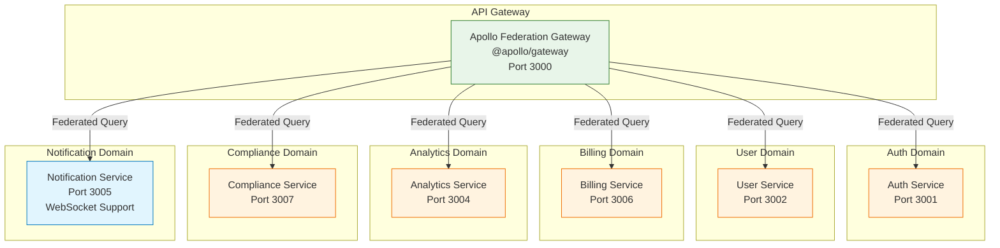
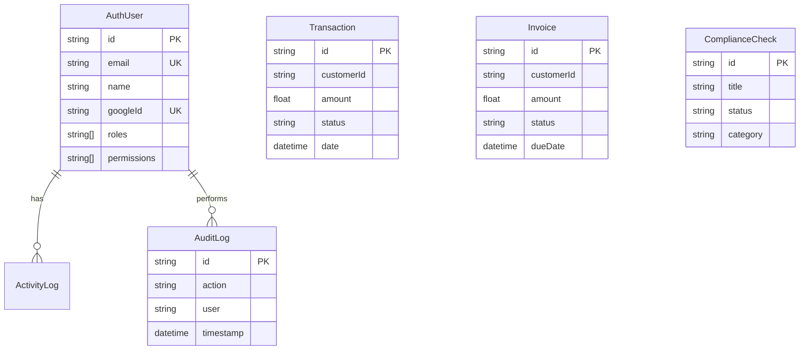
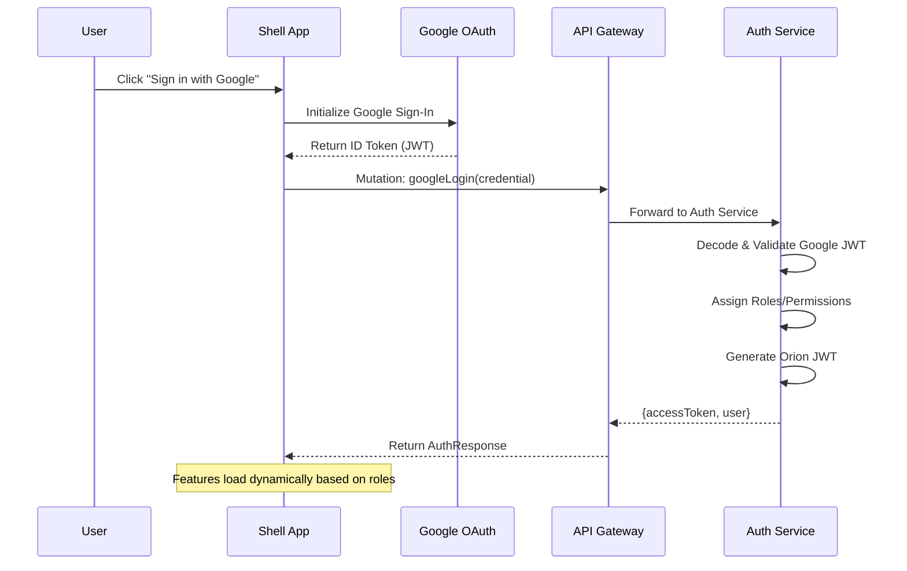

# Orion Enterprise
> **The Sovereign Microservices Control Plane**  
> *A unified, high-performance ecosystem for modern enterprise management.*

---

## 🌟 Project Overview 
**Orion Enterprise** is a sophisticated full-stack platform designed to consolidate fragmented enterprise operations into a single "Glass Pane" interface. Leveraging a state-of-the-art **Micro-Frontend (MFE)** architecture and a **Federated GraphQL** backend, it provides a seamless, real-time experience for managing authentication, billing, analytics, and compliance across large-scale organizations.

### 🚀 Key Benefits
- **Unified Experience**: Eliminates "tab fatigue" by stitching independent micro-frontends into a single cohesive dashboard.
- **Real-Time Intelligence**: Live data streaming for system performance, user activity, and financial metrics.
- **Enterprise-Grade Security**: Integrated Google Federated Login (OAuth2) with server-side verification and granular permission controls.
- **Automated Compliance**: Real-time monitoring of regulatory standards (GDPR, ISO 27001) with automated health scoring.
- **Scalable by Design**: Independent deployment and scaling of both frontend modules and backend microservices.

---

## 📁 Project Structure

This project is managed as an **Nx Monorepo**, ensuring high performance and shared code reusability.

```bash
orion/
├── apps/
│   ├── shell/                # The host application (Angular) - Orchestrates MFEs
│   ├── auth-service/         # Microservice for identity & OAuth verification
│   ├── user-service/         # Microservice for user profile management
│   ├── billing/              # Micro-Frontend for financial management
│   ├── billing-service/      # Microservice for transaction processing
│   ├── analytics/            # Micro-Frontend for data visualization
│   ├── analytics-service/    # Microservice for metric aggregation
│   ├── compliance/           # Micro-Frontend for security monitoring
│   ├── compliance-service/   # Microservice for audit logging & checks
│   ├── api-gateway/          # Apollo Federated Gateway (Stitches all subgraphs)
│   └── notification-service/ # Microservice for system alerts
├── libs/
│   ├── auth/                 # Shared authentication logic & NgRx state
│   ├── ui/                   # Shared design system & reusable components
│   └── shared/               # Shared utilities and types
├── prisma/                   # Database schemas (PostgreSQL / SQLite)
└── render.yaml               # Infrastructure as Code for Render.com deployment
```

---

## 🛠 Local Setup (Step-by-Step)

Follow these instructions to get the entire ecosystem running on your machine.

### 1. Prerequisites (What you need first)
Make sure you have these installed:
- **Node.js** (v18 or higher)
- **npm** (comes with Node)
- **Git**

### 2. Get the Code
Open your terminal and run:
```bash
git clone <your-repository-url>
cd orion
```

### 3. Install Dependencies
```bash
npm install
```

### 4. Database Setup
The services use **Prisma** with PostgreSQL (optimized for cloud) or SQLite (for local testing). 
Initialize the database for each service (example for auth-service):
```bash
# Repeat for each service in the apps/ directory
npx prisma db push --schema=apps/auth-service/prisma/schema.prisma
npx prisma generate --schema=apps/auth-service/prisma/schema.prisma
```
*(Tip: I have provided a `DEPLOYMENT.md` for production Neon.tech setup)*

### 5. Running the Application
To see the full power of Orion, you need to run the Gateway, the Services, and the Frontend.

**The Easy Way (Recommended):**
Open separate terminal tabs and run:
```bash
# Start the API Gateway (Port 3000)
npx nx serve api-gateway

# Start the Backend Services
npx nx serve auth-service
npx nx serve billing-service
# (Repeat for others as needed)

# Start the Frontend Shell (Port 4200)
npx nx serve shell
```

Visit `http://localhost:4200` in your browser.

---

---

## 🏗 Architecture & Diagrams

### 1. System Components & Orchestration
This system uses **Apollo GraphQL Federation** to stitch together independent microservices into a unified supergraph.



### 2. Database Entity Relationship (ER) Diagram
All services (except Auth) share a high-performance **PostgreSQL** instance via domain-isolated Prisma clients.



### 3. Authentication & Authorization Flow
Secure, stateless authentication via **Google OAuth 2.0** and **JWT**.



---

## 🏗 Architecture Guide: Adding Changes

---

## 📄 Documentation
For more in-depth details, check out these files:
- [Technical Deep Dive](./docs/TECHNICAL_DEEP_DIVE.md) - Deep architectural explanation.
- [Cloud Deployment Guide](./docs/DEPLOYMENT.md) - Vercel, Render, and Neon.tech instructions.
- [Portfolio Presentation](./docs/PORTFOLIO_ENTRY.md) - How to present this project.
- [AI Video Prompt Guide](./docs/VIDEO_GEN_PROMPT_GUIDE.md) - Generate a cinematic showcase.
