# Backend Microservices Architecture

## Overview

The Orion Enterprise platform uses a microservices architecture with NestJS and GraphQL, following Domain-Driven Design (DDD) principles.

## Microservices Component Diagram

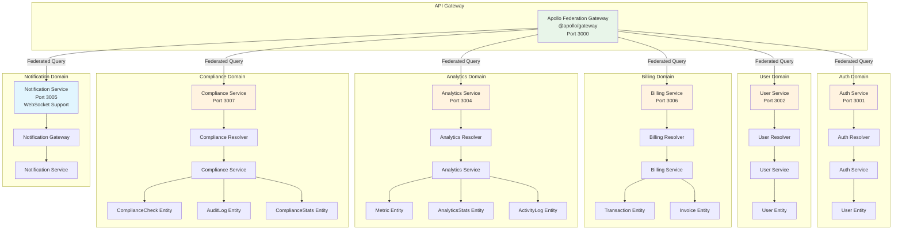

## NestJS Service Structure

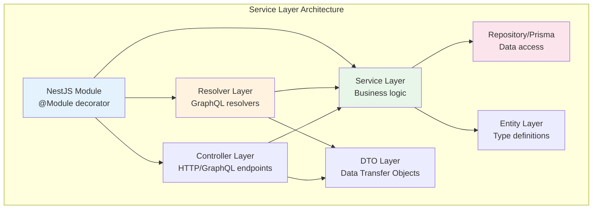

## Service Communication Pattern

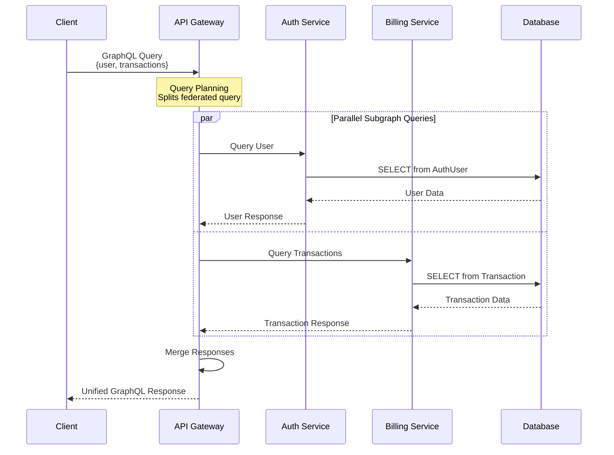

## GraphQL Schema Federation

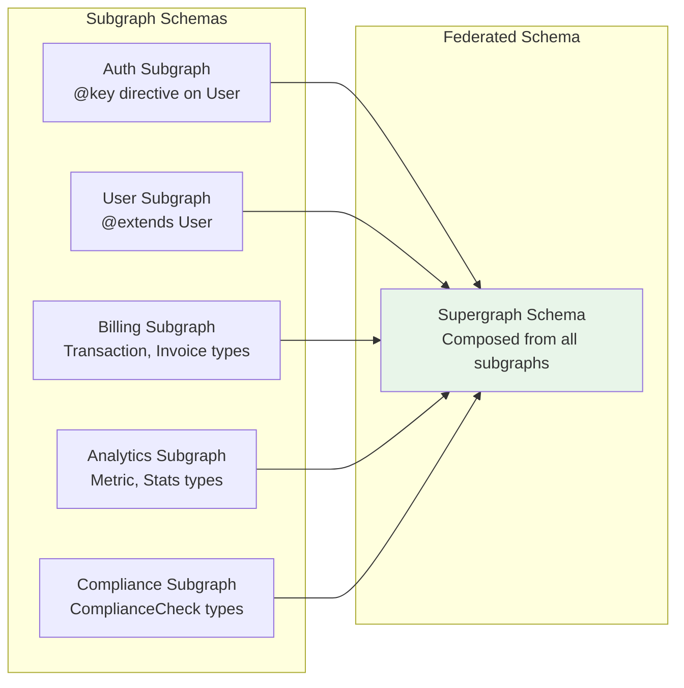

## Detailed Service Breakdown

### 1. Auth Service (Port 3001)

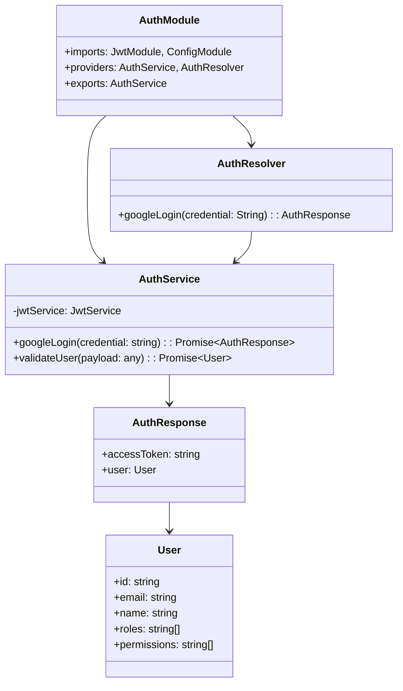

**Technologies:**

- NestJS + GraphQL Code-First
- JWT for token generation
- Google OAuth verification (stateless)
- No database dependency (stateless auth)

**Key Files:**

```
apps/auth-service/
├── src/
│   ├── app/
│   │   ├── app.module.ts          # Main module
│   │   └── auth/
│   │       ├── auth.resolver.ts   # GraphQL resolver
│   │       ├── auth.service.ts    # Business logic
│   │       └── dto/
│   │           └── auth-response.dto.ts
│   └── main.ts                     # Bootstrap
```

### 2. Billing Service (Port 3006)

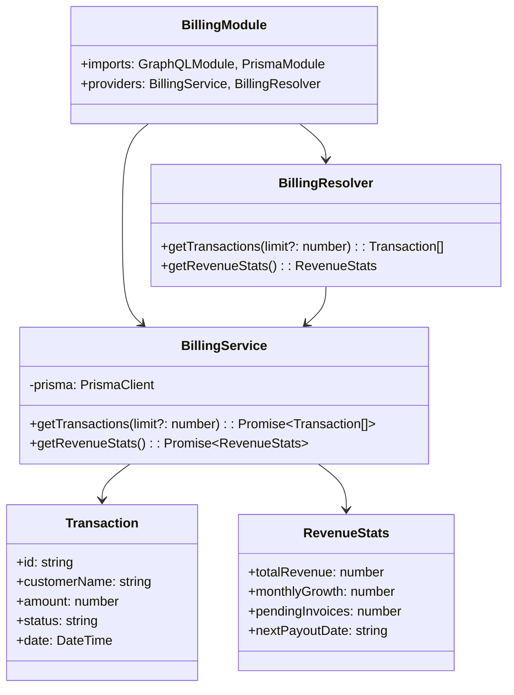

**Database Schema (Prisma):**

```prisma
model Transaction {
  id           String   @id @default(uuid())
  customerId   String
  customerName String
  amount       Float
  status       String
  date         DateTime @default(now())
}

model Invoice {
  id           String   @id @default(uuid())
  customerId   String
  amount       Float
  status       String
  dueDate      DateTime
  createdAt    DateTime @default(now())
}
```

### 3. Analytics Service (Port 3004)

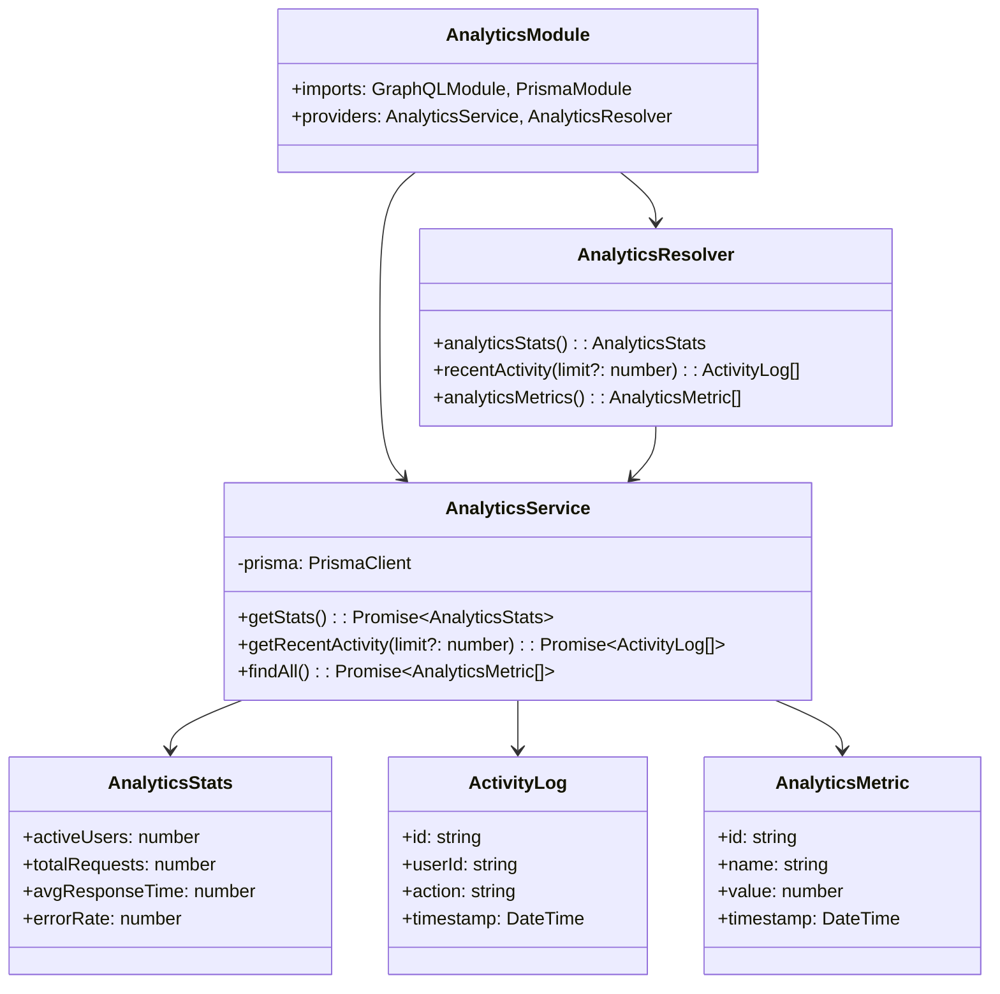

### 4. Compliance Service (Port 3007)

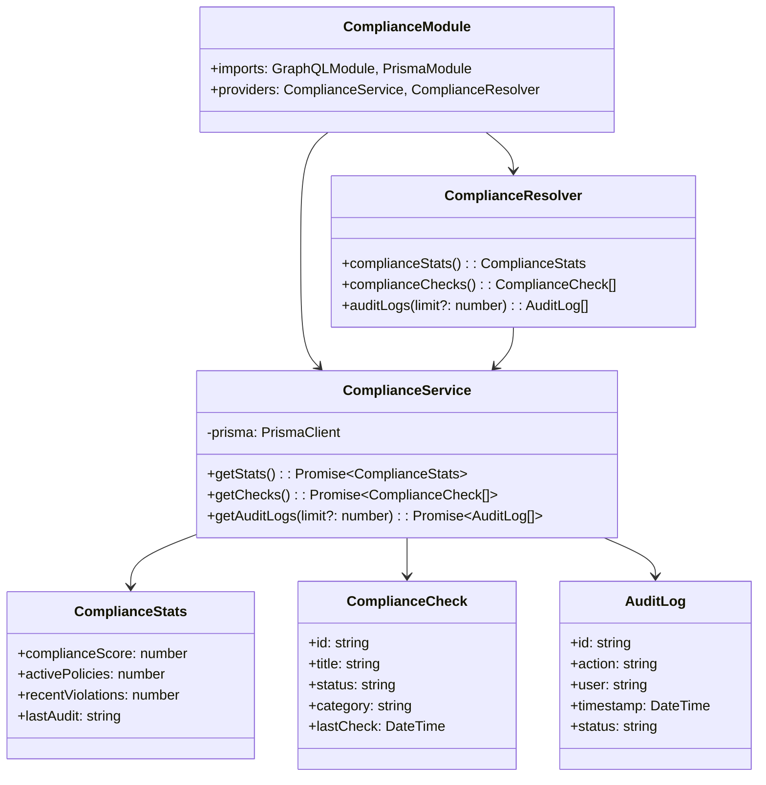

### 5. Notification Service (Port 3005)

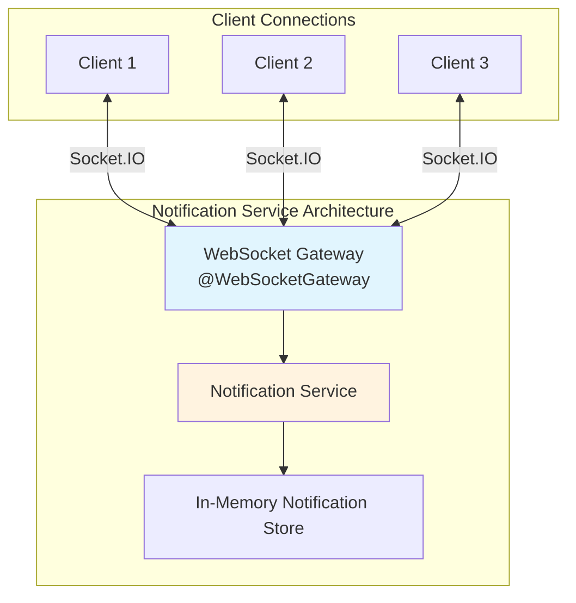

**WebSocket Events:**

- `connection`: Client connects
- `notification`: Server pushes notification
- `disconnect`: Client disconnects

## Service Startup Flow

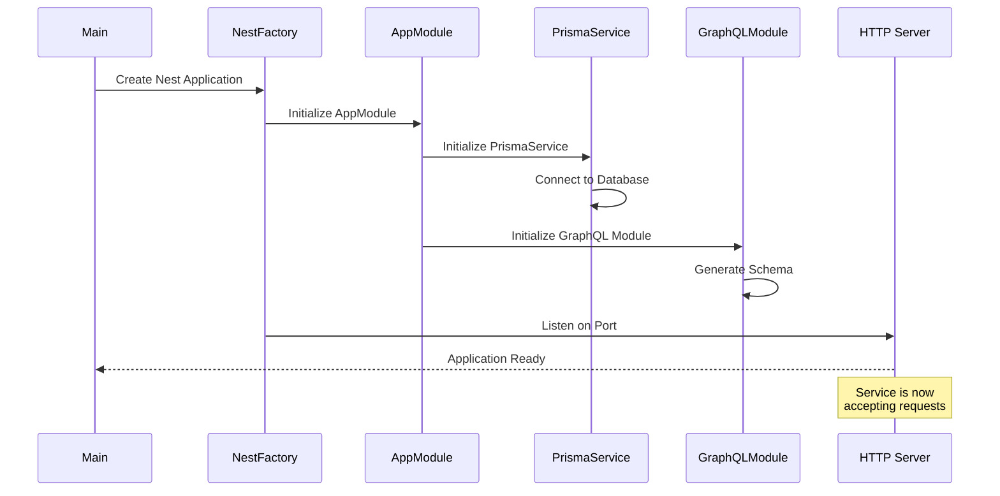

## Environment Configuration

Each service requires these environment variables:

```bash
# Database
DATABASE_URL="postgresql://..."

# Service-specific
PORT=3001                    # Service port
AUTH_SECRET="xxx"            # JWT secret (auth-service only)
GOOGLE_CLIENT_ID="xxx"       # Google OAuth (auth-service only)

# API Gateway (gateway service only)
AUTH_SERVICE_URL="http://localhost:3001/graphql"
USER_SERVICE_URL="http://localhost:3002/graphql"
BILLING_SERVICE_URL="http://localhost:3006/graphql"
ANALYTICS_SERVICE_URL="http://localhost:3004/graphql"
COMPLIANCE_SERVICE_URL="http://localhost:3007/graphql"
NOTIFICATION_SERVICE_URL="http://localhost:3005/graphql"
```

## Inter-Service Communication

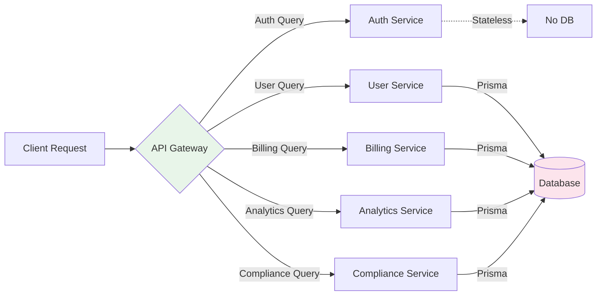

## Error Handling Strategy

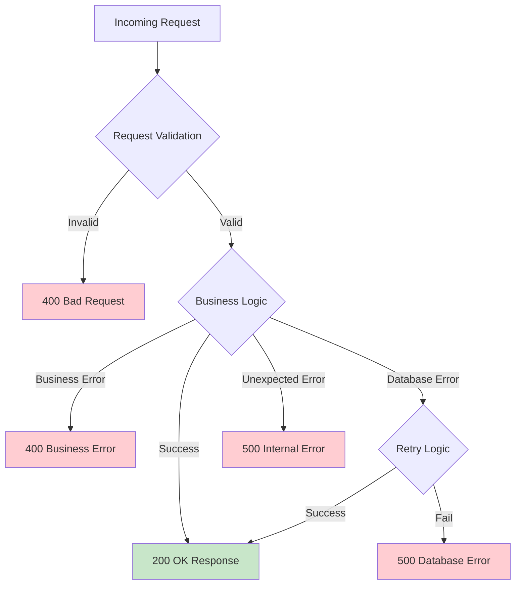

## Key Design Decisions

1. **Stateless Auth Service**: No database dependency, validates Google tokens directly
2. **Shared Database**: Cost-effective for MVP, services access different tables
3. **GraphQL Federation**: Single unified API, automatic schema composition
4. **NestJS Framework**: Type safety, dependency injection, decorators
5. **Prisma ORM**: Type-safe database access, migrations, code generation

## Performance Optimizations

- **Connection Pooling**: Prisma connection pooling for database efficiency
- **Query Optimization**: Efficient Prisma queries with select/include
- **Caching**: In-memory caching for frequently accessed data
- **Lazy Loading**: Module lazy loading in NestJS
- **Horizontal Scaling**: Stateless services can scale horizontally
