# Frontend Micro-Frontend Architecture (MFA)

## Overview

The Orion Enterprise frontend uses **Webpack Module Federation** to implement a Micro-Frontend Architecture (MFA), enabling independent development, deployment, and scaling of feature modules.

## Micro-Frontend Architecture

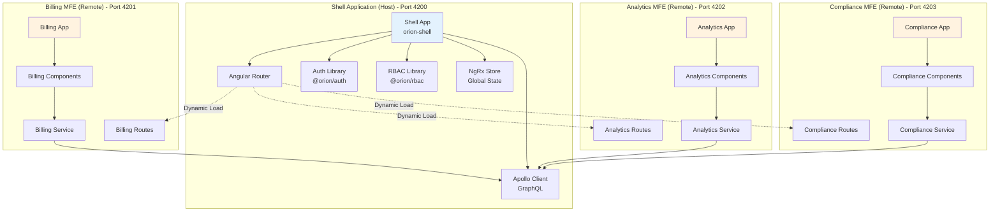

## Module Federation Configuration

```mermaid
graph LR
    subgraph "Host (Shell)"
        H[webpack.config.js<br/>ModuleFederationPlugin]
        H_EXP[Exposes: None]
        H_REM[Remotes:<br/>billing, analytics, compliance]
        H_SHARE[Shared:<br/>@angular/*, rxjs, etc.]
    end

    subgraph "Remote (Billing)"
        R1[webpack.config.js<br/>ModuleFederationPlugin]
        R1_EXP[Exposes:<br/>./Routes]
        R1_REM[Remotes: None]
        R1_SHARE[Shared: Same as Host]
    end

    subgraph "Remote (Analytics)"
        R2[webpack.config.js<br/>ModuleFederationPlugin]
        R2_EXP[Exposes:<br/>./Routes]
        R2_REM[Remotes: None]
        R2_SHARE[Shared: Same as Host]
    end

    subgraph "Remote (Compliance)"
        R3[webpack.config.js<br/>ModuleFederationPlugin]
        R3_EXP[Exposes:<br/>./Routes]
        R3_REM[Remotes: None]
        R3_SHARE[Shared: Same as Host]
    end

    H --> H_REM
    H_REM -.->|Loads| R1_EXP
    H_REM -.->|Loads| R2_EXP
    H_REM -.->|Loads| R3_EXP

    style H fill:#e8f5e9
    style R1 fill:#fff3e0
    style R2 fill:#fff3e0
    style R3 fill:#fff3e0
```

## Shell Application Architecture

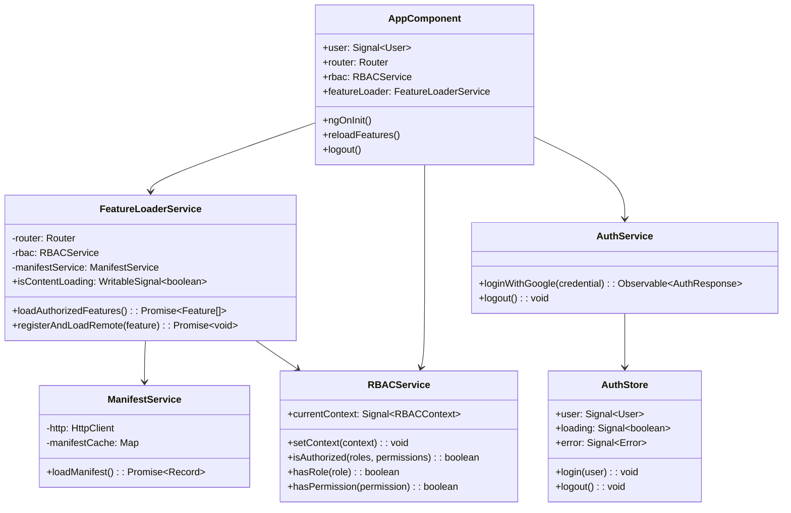

## Dynamic Module Loading Flow

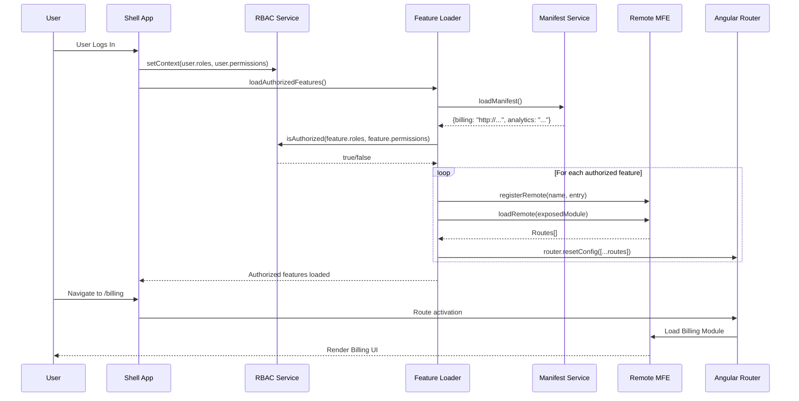

## Feature Metadata Configuration

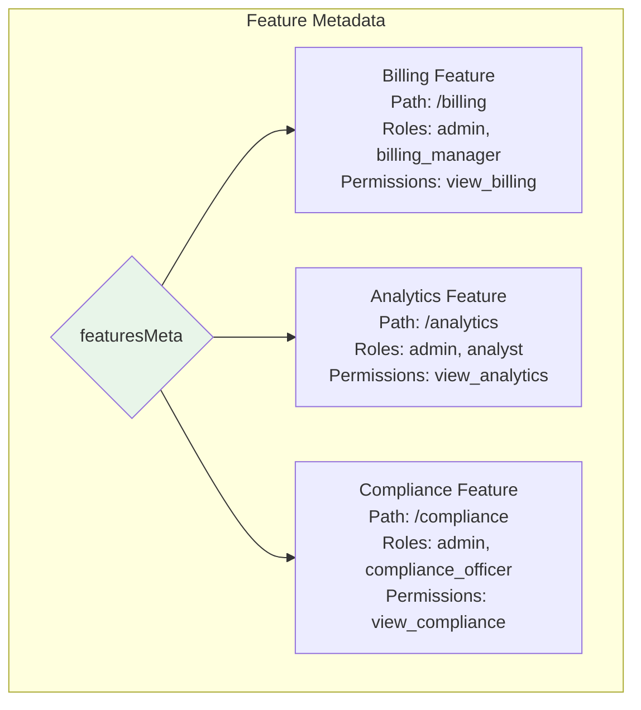

## Component Communication Patterns

### 1. Parent-Child Communication

```mermaid
graph TB
    A[Shell Component] -->|@Input| B[Sidebar Component]
    B -->|@Output| A
    A -->|@Input| C[Header Component]
    C -->|@Output| A
```

### 2. Service-Based Communication

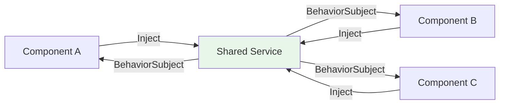

### 3. NgRx Store Communication

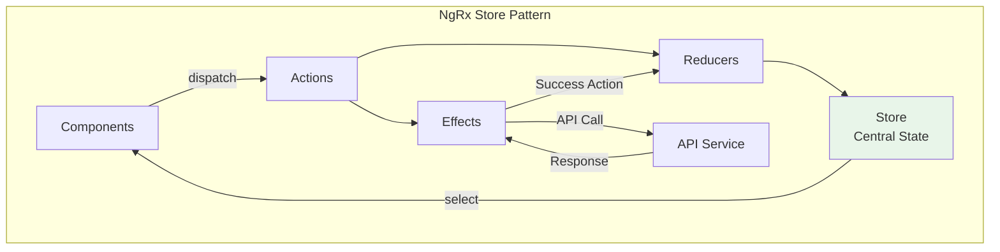

## Billing MFE Detailed Architecture

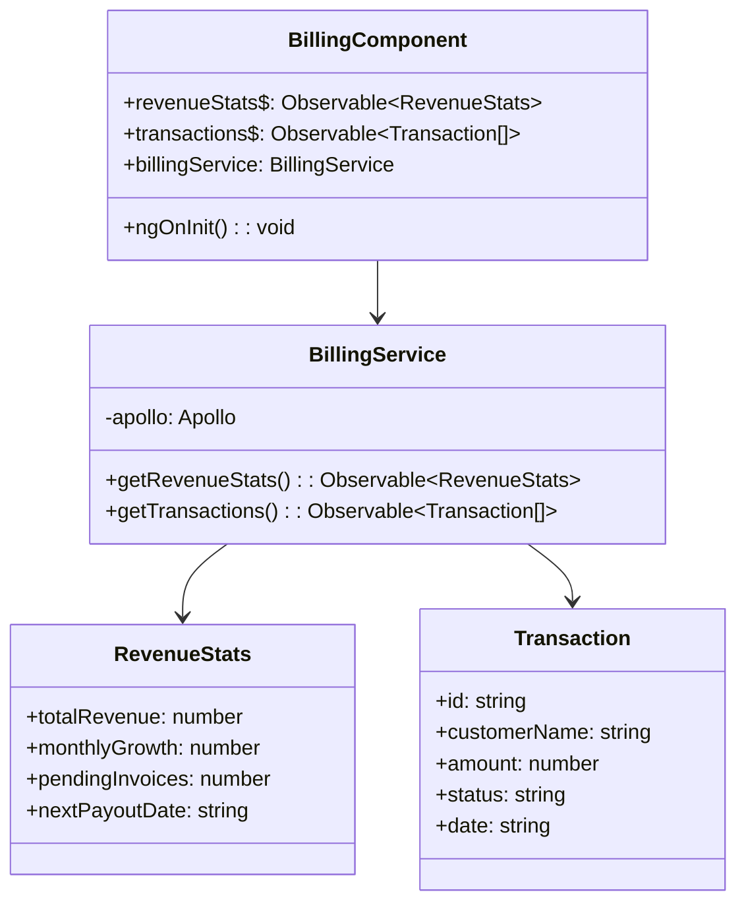

**GraphQL Queries:**

```graphql
query GetRevenueStats {
  revenueStats {
    totalRevenue
    monthlyGrowth
    pendingInvoices
    nextPayoutDate
  }
}

query GetTransactions {
  transactions {
    id
    customerName
    amount
    status
    date
  }
}
```

## Analytics MFE Detailed Architecture

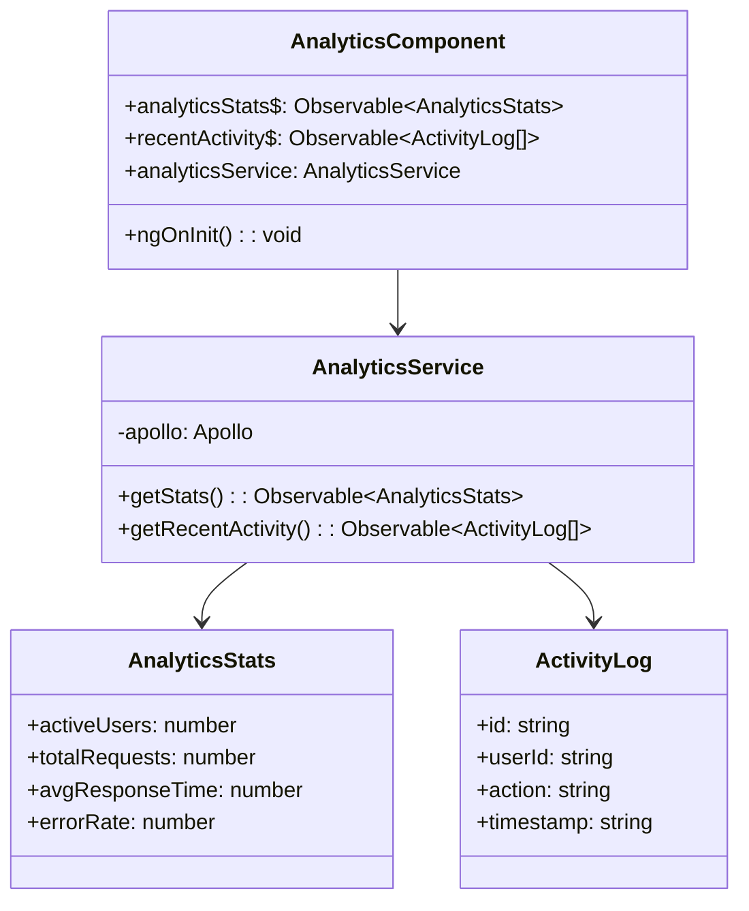

## Compliance MFE Detailed Architecture

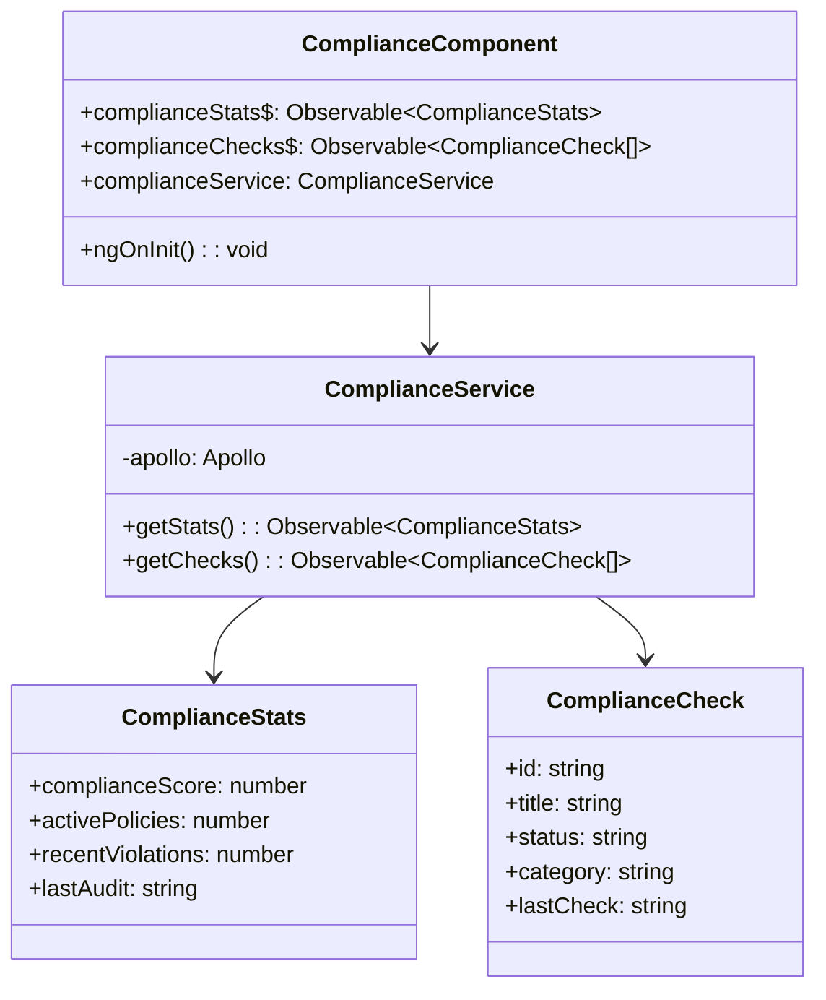

## Shared Libraries Architecture

```mermaid
graph TB
    subgraph "Shared Libraries (Nx Workspace)"
        AUTH[@orion/auth<br/>Authentication logic]
        RBAC[@orion/rbac<br/>Authorization logic]
        UI[@orion/ui<br/>UI components]
        UTILS[@orion/utils<br/>Utilities]
    end

    subgraph "Applications"
        SHELL[Shell App]
        BILL[Billing MFE]
        ANLY[Analytics MFE]
        COMP[Compliance MFE]
    end

    SHELL --> AUTH
    SHELL --> RBAC
    SHELL --> UI
    SHELL --> UTILS

    BILL --> UI
    BILL --> UTILS

    ANLY --> UI
    ANLY --> UTILS

    COMP --> UI
    COMP --> UTILS

    style AUTH fill:#e3f2fd
    style RBAC fill:#e3f2fd
    style UI fill:#e3f2fd
    style UTILS fill:#e3f2fd
```

## Module Federation Manifest

```mermaid
graph TB
    subgraph "Manifest File (module-federation.manifest.json)"
        MAN[{<br/>"billing": "http://localhost:4201/remoteEntry.mjs",<br/>"analytics": "http://localhost:4202/remoteEntry.mjs",<br/>"compliance": "http://localhost:4203/remoteEntry.mjs"<br/>}]
    end

    subgraph "Runtime Loading"
        LOADER[Feature Loader Service]
        REG[registerRemotes()]
        LOAD[loadRemote()]
    end

    MAN --> LOADER
    LOADER --> REG
    REG --> LOAD

    style MAN fill:#fff3e0
```

## Routing Strategy

```mermaid
graph TB
    ROOT[/] --> LOGIN[/login]
    ROOT --> DYNAMIC[/** Catch-all]

    DYNAMIC -.->|Lazy Load| BILL[/billing]
    DYNAMIC -.->|Lazy Load| ANLY[/analytics]
    DYNAMIC -.->|Lazy Load| COMP[/compliance]

    BILL --> BILL_DASH[/billing/dashboard]
    BILL --> BILL_TRANS[/billing/transactions]

    ANLY --> ANLY_DASH[/analytics/dashboard]
    ANLY --> ANLY_REP[/analytics/reports]

    COMP --> COMP_DASH[/compliance/dashboard]
    COMP --> COMP_AUD[/compliance/audits]

    style ROOT fill:#e8f5e9
    style DYNAMIC fill:#fff3e0
```

## State Management with NgRx

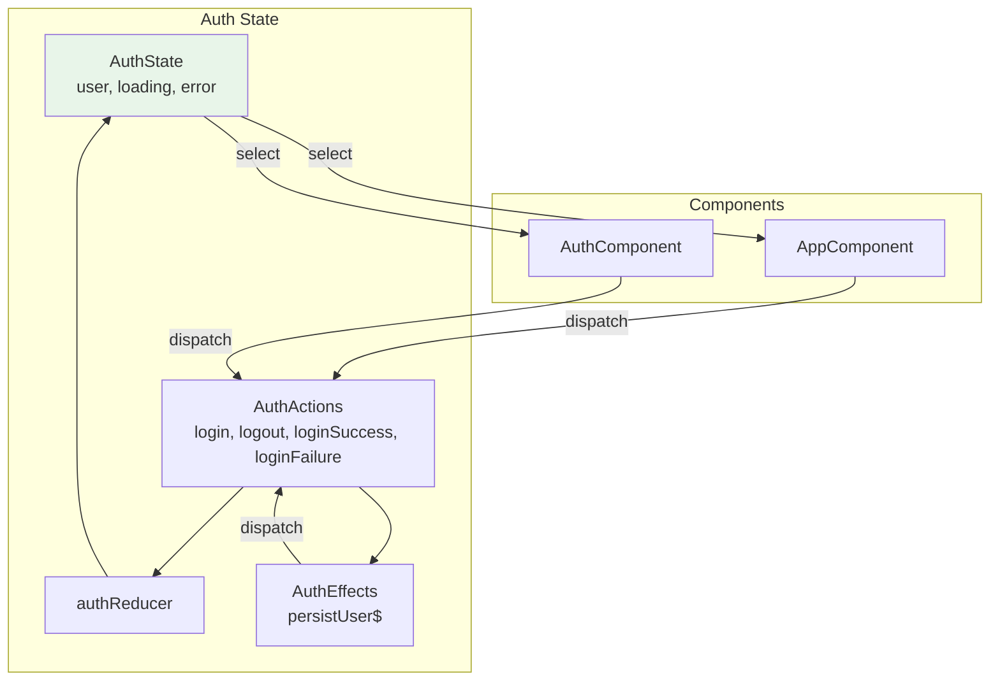

## Apollo GraphQL Client Configuration

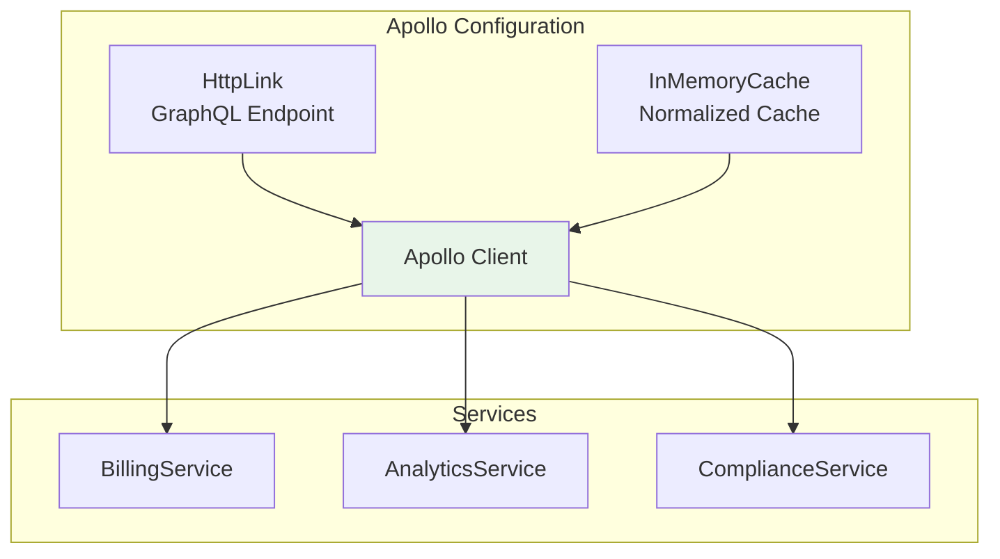

## Build & Bundle Strategy

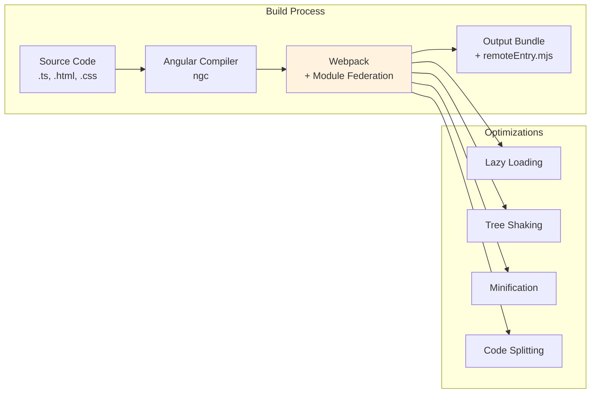

## Error Handling Strategy

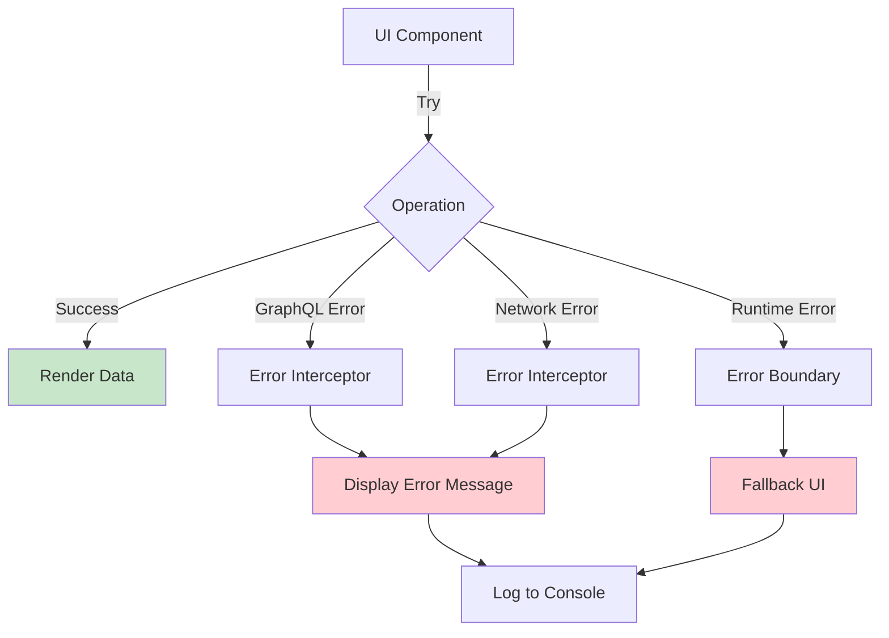

## Performance Optimizations

1. **Code Splitting**: Each MFE is a separate bundle
2. **Lazy Loading**: Routes loaded on-demand
3. **Shared Dependencies**: Common libraries shared across MFEs
4. **OnPush Change Detection**: Optimized change detection strategy
5. **TrackBy Functions**: Efficient list rendering
6. **Memoization**: Signal-based reactivity
7. **Bundle Analysis**: Webpack Bundle Analyzer

## Key Design Decisions

1. **Module Federation over iframes**: Better performance, shared dependencies
2. **Route-based MFEs**: Each feature is a separate deployable unit
3. **Shared Apollo Client**: Single GraphQL client instance
4. **RBAC-based loading**: Only load authorized features
5. **Centralized Auth**: Shell manages authentication
6. **Nx Monorepo**: Shared libraries, unified tooling

## Deployment Architecture

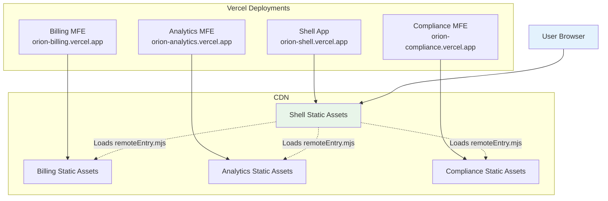
