# Authentication & Authorization Flow

## Overview

The Orion Enterprise platform uses Google OAuth 2.0 for authentication with JWT tokens, combined with Role-Based Access Control (RBAC) for authorization.

## Complete Authentication Flow

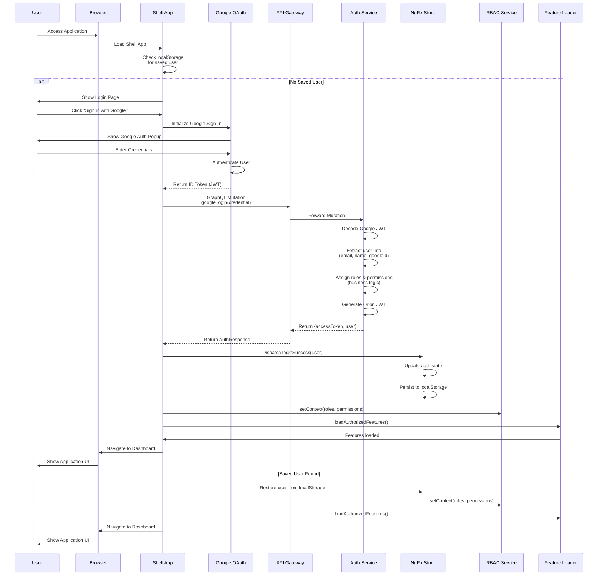

## Google OAuth 2.0 Integration

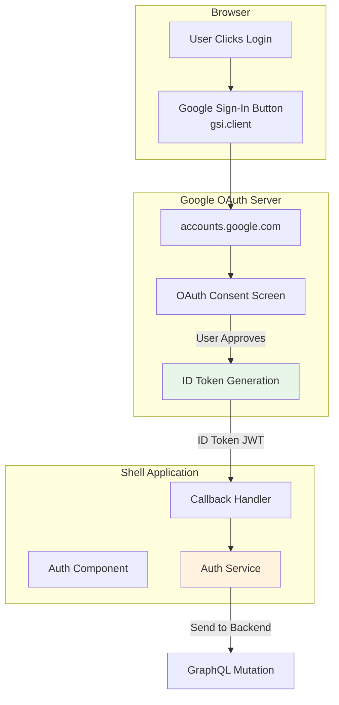

**Google Sign-In Configuration:**

```typescript
// Shell App - Initialize Google Sign-In
google.accounts.id.initialize({
  client_id: environment.googleClientId,
  callback: (response) => {
    // response.credential contains the JWT
    this.handleGoogleResponse(response);
  },
  auto_select: false,
  cancel_on_tap_outside: true,
});

// Render the button
google.accounts.id.renderButton(document.getElementById('google-signin-button'), {
  theme: 'outline',
  size: 'large',
  text: 'continue_with',
  shape: 'rectangular',
});
```

## JWT Token Structure

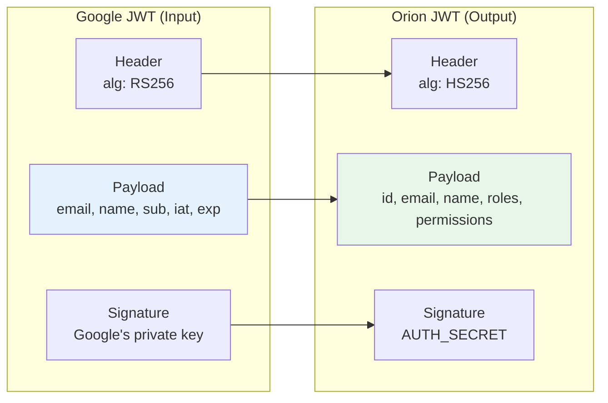

**Orion JWT Payload:**

```json
{
  "id": "uuid-v4",
  "email": "user@example.com",
  "name": "John Doe",
  "roles": ["admin", "billing_manager"],
  "permissions": ["view_billing", "edit_billing", "view_analytics"],
  "iat": 1709500000,
  "exp": 1709586400
}
```

## Auth Service Implementation

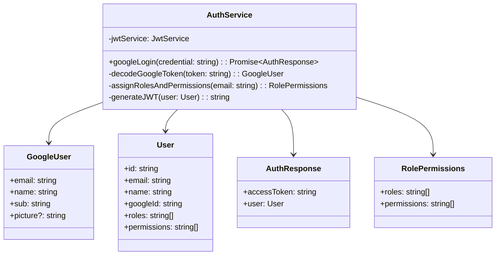

**Auth Service Code:**

```typescript
@Injectable()
export class AuthService {
  constructor(private jwtService: JwtService) {}

  async googleLogin(credential: string): Promise<AuthResponse> {
    // 1. Decode Google JWT
    const decoded = this.decodeGoogleToken(credential);

    // 2. Create user object
    const user: User = {
      id: uuidv4(),
      email: decoded.email,
      name: decoded.name,
      googleId: decoded.sub,
      ...this.assignRolesAndPermissions(decoded.email),
    };

    // 3. Generate Orion JWT
    const accessToken = this.jwtService.sign({
      id: user.id,
      email: user.email,
      name: user.name,
      roles: user.roles,
      permissions: user.permissions,
    });

    return {
      accessToken,
      user,
    };
  }

  private assignRolesAndPermissions(email: string): RolePermissions {
    // Business logic for role assignment
    if (email.endsWith('@admin.com')) {
      return {
        roles: ['admin'],
        permissions: ['view_all', 'edit_all', 'delete_all'],
      };
    }

    return {
      roles: ['user'],
      permissions: ['view_billing', 'view_analytics'],
    };
  }
}
```

## Frontend Auth State Management

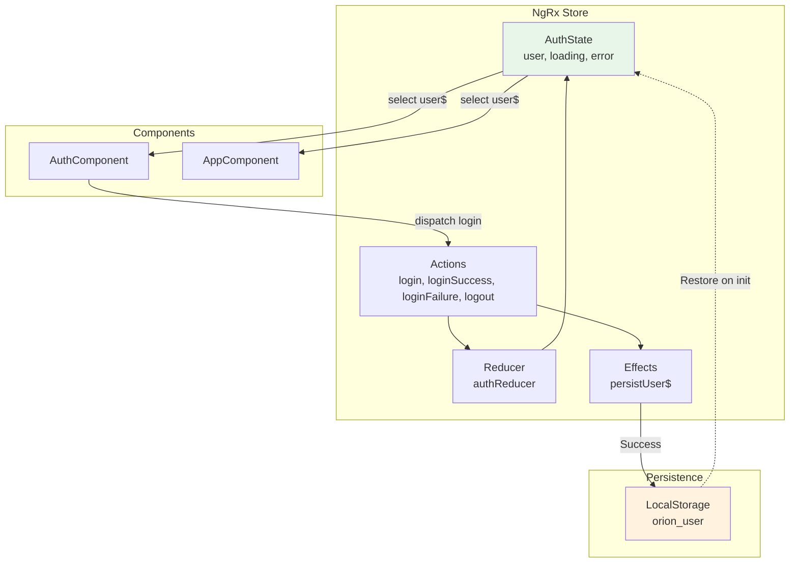

**NgRx State Implementation:**

```typescript
// State
export interface AuthState {
  user: User | null;
  loading: boolean;
  error: string | null;
}

// Actions
export const AuthActions = createActionGroup({
  source: 'Auth',
  events: {
    Login: props<{ credential: string }>(),
    'Login Success': props<{ user: User }>(),
    'Login Failure': props<{ error: string }>(),
    Logout: emptyProps(),
  },
});

// Reducer
export const authReducer = createReducer(
  initialState,
  on(AuthActions.loginSuccess, (state, { user }) => ({
    ...state,
    user,
    loading: false,
    error: null,
  })),
  on(AuthActions.logout, () => initialState),
);

// Effects
export class AuthEffects {
  persistUser$ = createEffect(
    () =>
      this.actions$.pipe(
        ofType(AuthActions.loginSuccess),
        map(({ user }) => {
          localStorage.setItem('orion_user', JSON.stringify(user));
          return { type: 'NO_ACTION' };
        }),
      ),
    { dispatch: false },
  );
}
```

## Role-Based Access Control (RBAC)

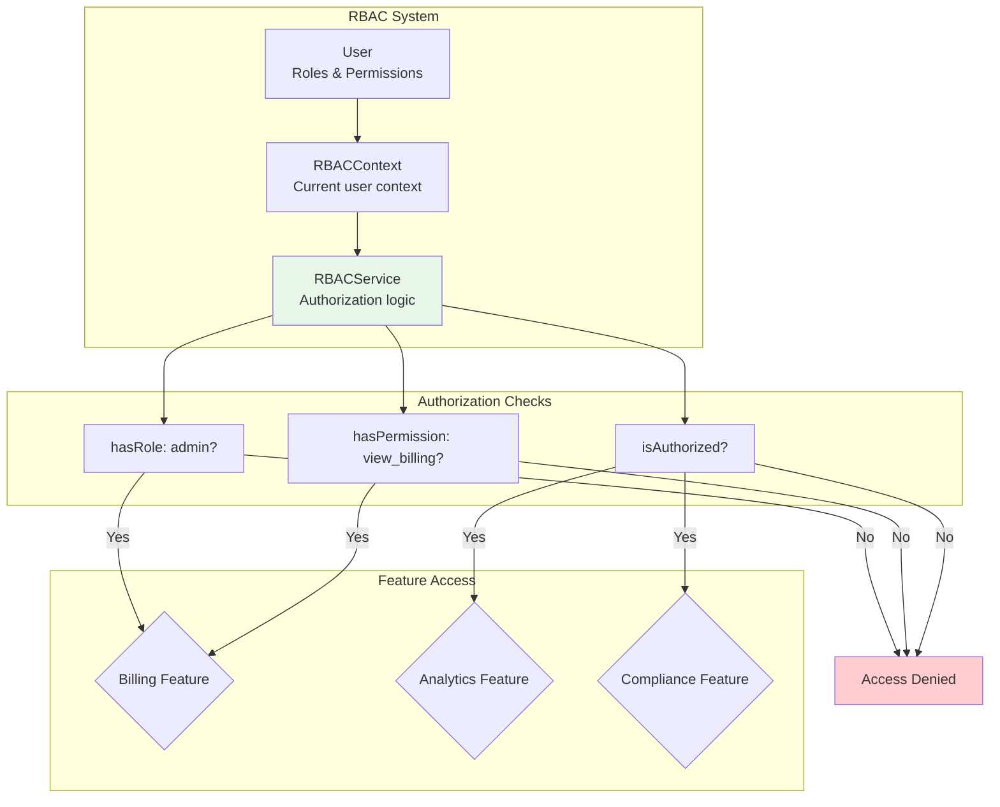

**RBAC Service Implementation:**

```typescript
@Injectable({ providedIn: 'root' })
export class RBACService {
  private contextSignal = signal<RBACContext | null>(null);

  currentContext = this.contextSignal.asReadonly();

  setContext(context: RBACContext): void {
    this.contextSignal.set(context);
  }

  isAuthorized(requiredRoles: string[] = [], requiredPermissions: string[] = []): boolean {
    const context = this.contextSignal();
    if (!context) return false;

    const hasRole = requiredRoles.length === 0 || requiredRoles.some((role) => context.roles.includes(role));

    const hasPermission = requiredPermissions.length === 0 || requiredPermissions.some((perm) => context.permissions.includes(perm));

    return hasRole && hasPermission;
  }

  hasRole(role: string): boolean {
    return this.contextSignal()?.roles.includes(role) ?? false;
  }

  hasPermission(permission: string): boolean {
    return this.contextSignal()?.permissions.includes(permission) ?? false;
  }
}
```

## Feature Loading with RBAC

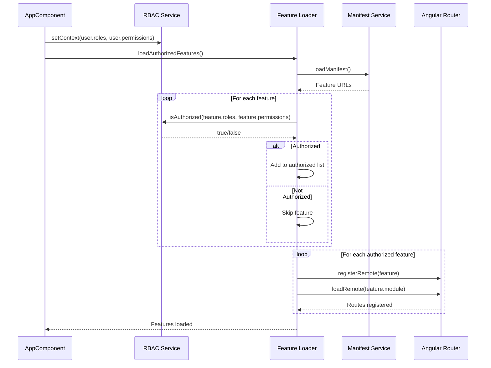

## Feature Metadata for RBAC

```typescript
export interface FeatureMeta {
  key: string;
  displayName: string;
  routePath: string;
  icon: string;
  enabled: boolean;
  roles: string[];
  permissions: string[];
}

// Feature definitions
export const featuresMeta: Record<string, FeatureMeta> = {
  billing: {
    key: 'billing',
    displayName: 'Billing',
    routePath: 'billing',
    icon: 'attach_money',
    enabled: true,
    roles: ['admin', 'billing_manager'],
    permissions: ['view_billing'],
  },
  analytics: {
    key: 'analytics',
    displayName: 'Analytics',
    routePath: 'analytics',
    icon: 'analytics',
    enabled: true,
    roles: ['admin', 'analyst'],
    permissions: ['view_analytics'],
  },
  compliance: {
    key: 'compliance',
    displayName: 'Compliance',
    routePath: 'compliance',
    icon: 'verified_user',
    enabled: true,
    roles: ['admin', 'compliance_officer'],
    permissions: ['view_compliance'],
  },
};
```

## Authorization Matrix

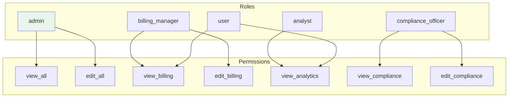

**Authorization Matrix Table:**

| Role                 | Permissions                                   |
| -------------------- | --------------------------------------------- |
| `admin`              | `view_all`, `edit_all`, `delete_all`          |
| `billing_manager`    | `view_billing`, `edit_billing`                |
| `analyst`            | `view_analytics`, `export_reports`            |
| `compliance_officer` | `view_compliance`, `edit_compliance`, `audit` |
| `user`               | `view_billing`, `view_analytics`              |

## Session Management

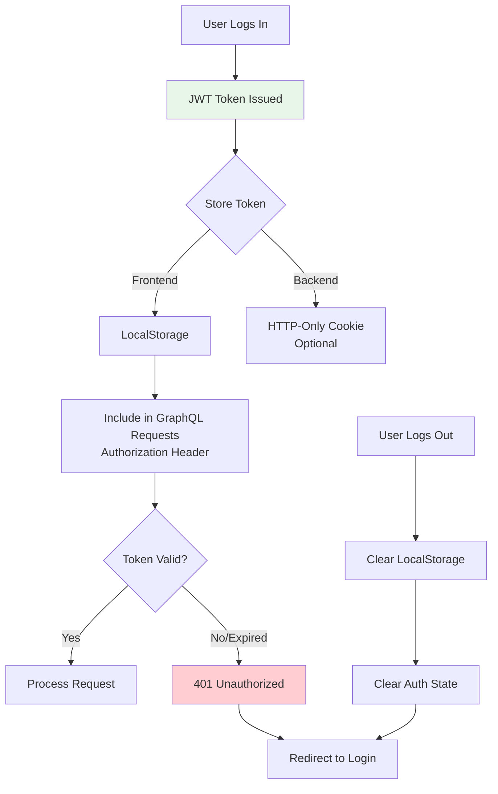

**Token Lifecycle:**

1. **Issue**: JWT issued after successful Google login
2. **Store**: Saved in localStorage as `orion_user`
3. **Use**: Included in Authorization header for API requests (if needed)
4. **Expiry**: 24 hours (configurable)
5. **Refresh**: Not implemented (user re-authenticates)
6. **Revoke**: Logout clears localStorage

## Security Considerations

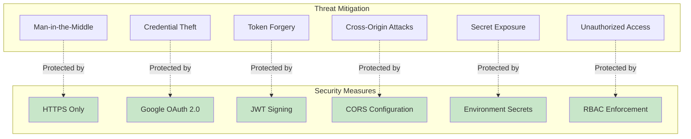

**Security Best Practices:**

1. **Never expose client secrets in frontend code**
2. **Use HTTPS for all communication**
3. **Validate JWT tokens on backend if implementing protected routes**
4. **Implement token expiration**
5. **Use environment variables for sensitive configuration**
6. **Implement rate limiting on auth endpoints**
7. **Log authentication events for audit**

## Logout Flow

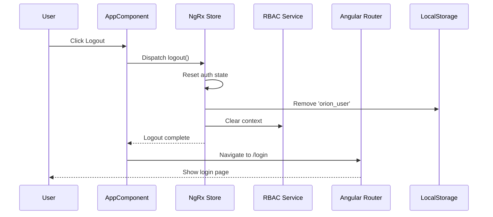

## Error Handling in Auth Flow

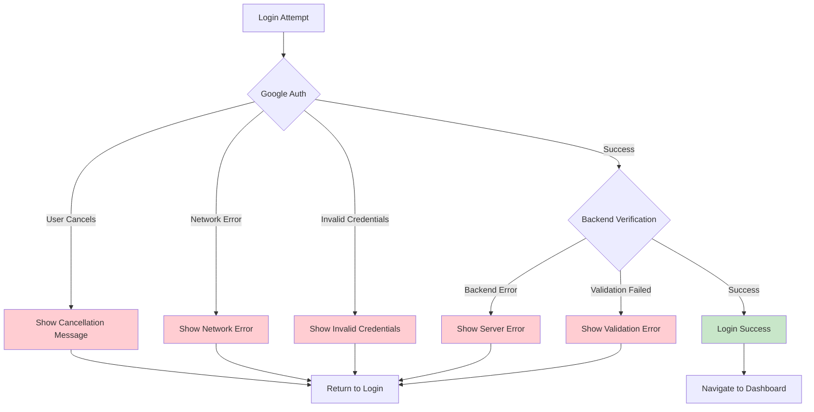

## Key Design Decisions

1. **Stateless Auth Service**: No database lookup on every auth check
2. **Google OAuth Only**: Single sign-on provider for simplicity
3. **JWT in LocalStorage**: Simpler than HTTP-only cookies for SPA
4. **Frontend RBAC**: Feature loading based on roles/permissions
5. **No Token Refresh**: Users re-authenticate after expiry (24h)
6. **Role Assignment in Auth Service**: Business logic determines roles
7. **NgRx for State**: Centralized auth state management

## Future Enhancements

- [ ] Implement JWT refresh tokens
- [ ] Add backend JWT validation middleware
- [ ] Support multiple OAuth providers (GitHub, Microsoft)
- [ ] Implement session timeout warnings
- [ ] Add 2FA (Two-Factor Authentication)
- [ ] Implement permission-based UI element hiding
- [ ] Add audit logging for all auth events
- [ ] Implement password-based auth as fallback
