# API Gateway & GraphQL Federation

## Overview

The API Gateway uses **Apollo Federation** to compose multiple GraphQL subgraphs into a single unified GraphQL API, providing a single entry point for all client queries.

## API Gateway Architecture

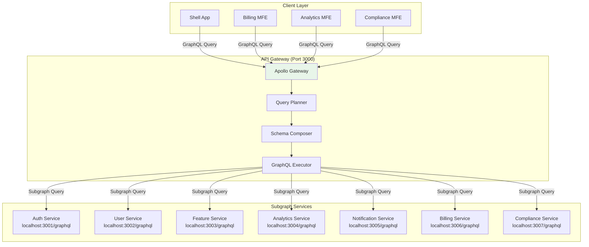

## Gateway Configuration

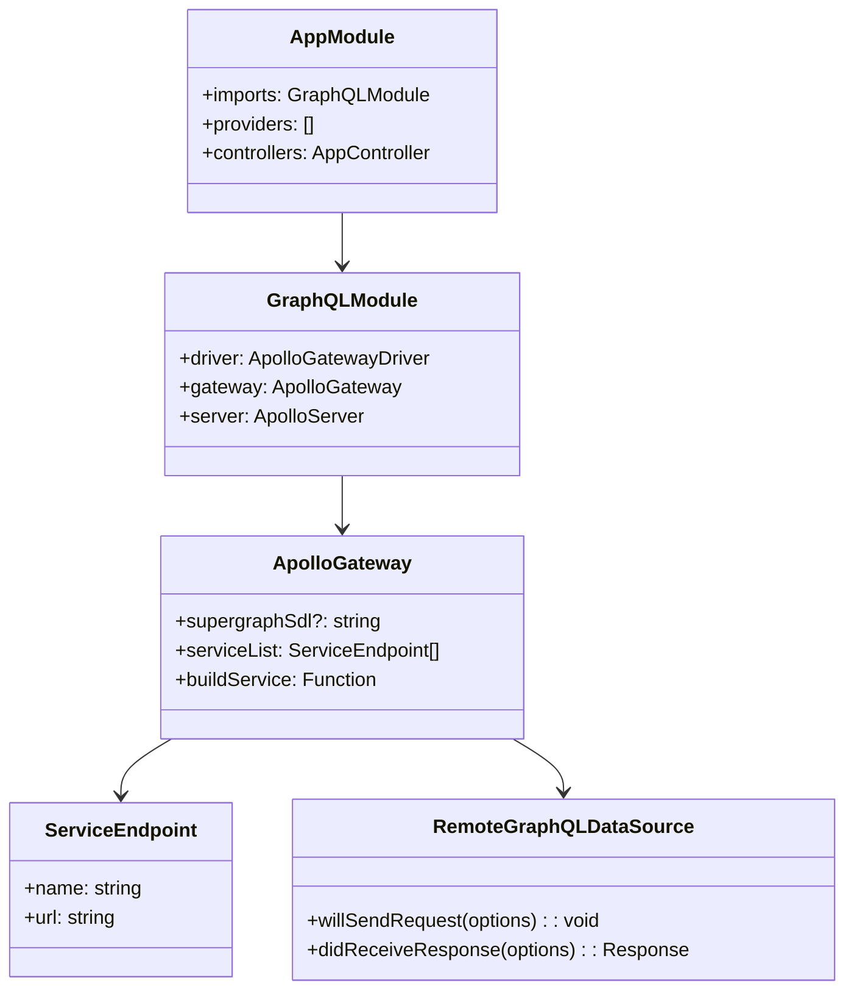

**Gateway Configuration Code:**

```typescript
// apps/api-gateway/src/app/app.module.ts
@Module({
  imports: [
    GraphQLModule.forRoot<ApolloGatewayDriverConfig>({
      driver: ApolloGatewayDriver,
      gateway: {
        serviceList: [
          { name: 'auth', url: process.env.AUTH_SERVICE_URL },
          { name: 'users', url: process.env.USER_SERVICE_URL },
          { name: 'features', url: process.env.FEATURE_SERVICE_URL },
          { name: 'analytics', url: process.env.ANALYTICS_SERVICE_URL },
          { name: 'notifications', url: process.env.NOTIFICATION_SERVICE_URL },
          { name: 'billing', url: process.env.BILLING_SERVICE_URL },
          { name: 'compliance', url: process.env.COMPLIANCE_SERVICE_URL },
        ],
        buildService({ url }) {
          return new RemoteGraphQLDataSource({
            url,
            willSendRequest({ request, context }) {
              // Forward headers, add auth token, etc.
              request.http.headers.set('authorization', context.req?.headers?.authorization || '');
            },
          });
        },
      },
      server: {
        context: ({ req }) => ({ req }),
      },
    }),
  ],
})
export class AppModule {}
```

## Subgraph Registration

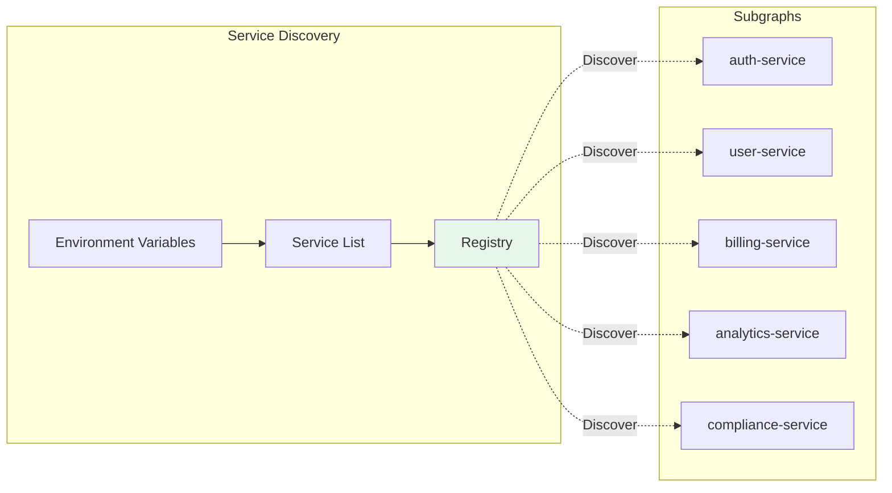

**Environment Configuration:**

```bash
# .env for API Gateway
AUTH_SERVICE_URL=http://localhost:3001/graphql
USER_SERVICE_URL=http://localhost:3002/graphql
FEATURE_SERVICE_URL=http://localhost:3003/graphql
ANALYTICS_SERVICE_URL=http://localhost:3004/graphql
NOTIFICATION_SERVICE_URL=http://localhost:3005/graphql
BILLING_SERVICE_URL=http://localhost:3006/graphql
COMPLIANCE_SERVICE_URL=http://localhost:3007/graphql
```

## Query Planning & Execution

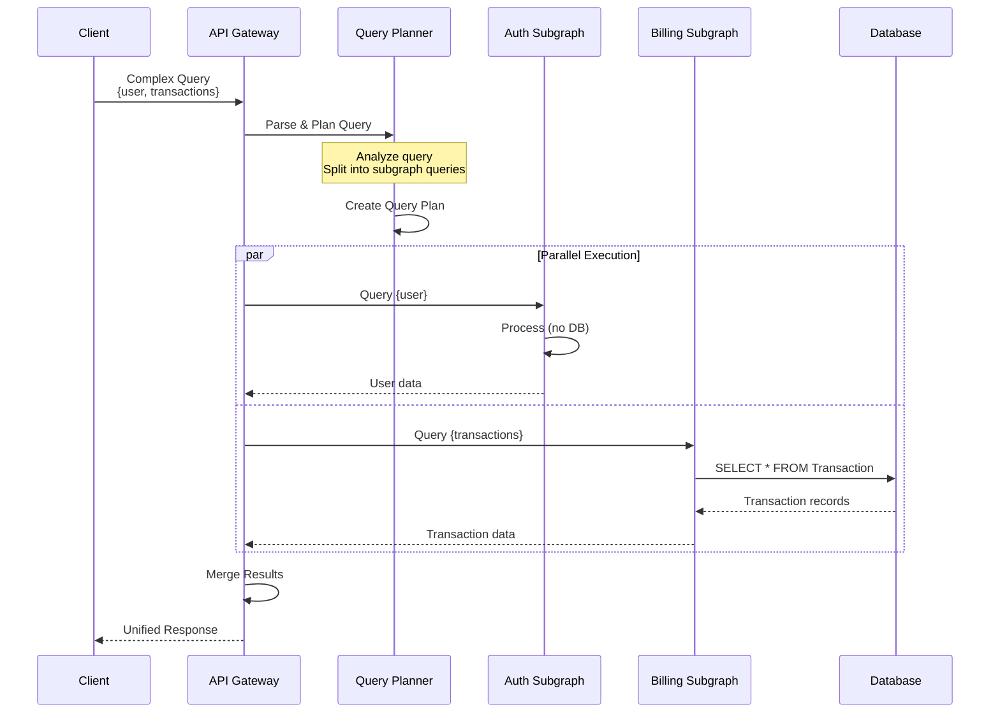

**Example Query Plan:**

```graphql
# Client sends this query
query GetUserWithTransactions {
  user(id: "user-123") {
    id
    name
    email
  }
  transactions(limit: 10) {
    id
    customerName
    amount
    status
  }
}

# Gateway splits into:
# ┌─────────────────────────────────────┐
# │ To Auth Service:                    │
# │ query {                             │
# │   user(id: "user-123") {            │
# │     id                              │
# │     name                            │
# │     email                           │
# │   }                                 │
# │ }                                   │
# └─────────────────────────────────────┘
#
# ┌─────────────────────────────────────┐
# │ To Billing Service:                 │
# │ query {                             │
# │   transactions(limit: 10) {         │
# │     id                              │
# │     customerName                    │
# │     amount                          │
# │     status                          │
# │   }                                 │
# │ }                                   │
# └─────────────────────────────────────┘
```

## Schema Composition

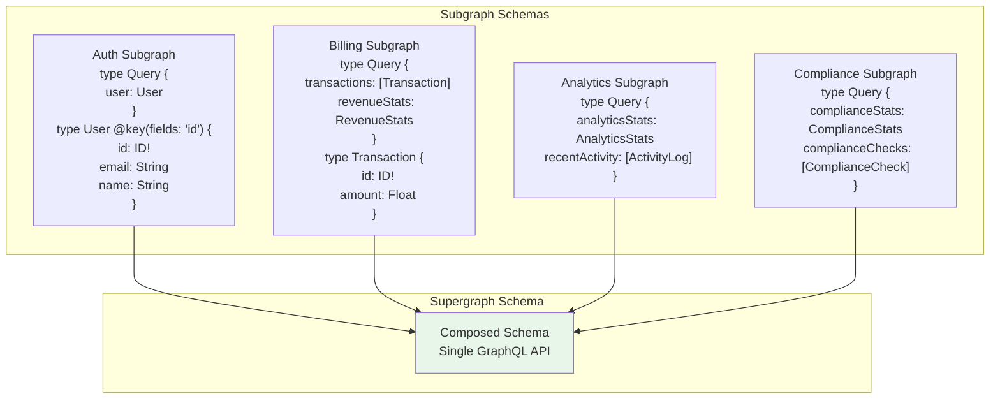

## GraphQL Schema Federation Directives

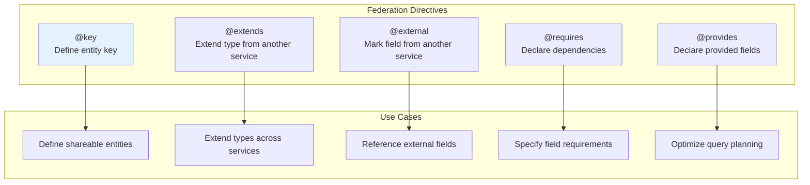

**Example Federation Schema:**

```graphql
# Auth Service Schema
type User @key(fields: "id") {
  id: ID!
  email: String!
  name: String!
  roles: [String!]!
  permissions: [String!]!
}

type Query {
  user(id: ID!): User
}

# User Service Schema (extends User)
extend type User @key(fields: "id") {
  id: ID! @external
  profile: UserProfile
  settings: UserSettings
}

type UserProfile {
  bio: String
  avatar: String
}
```

## Request Flow Through Gateway

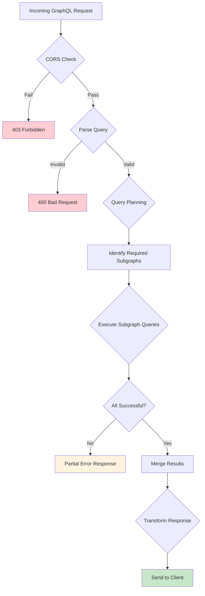

## Error Handling Strategy

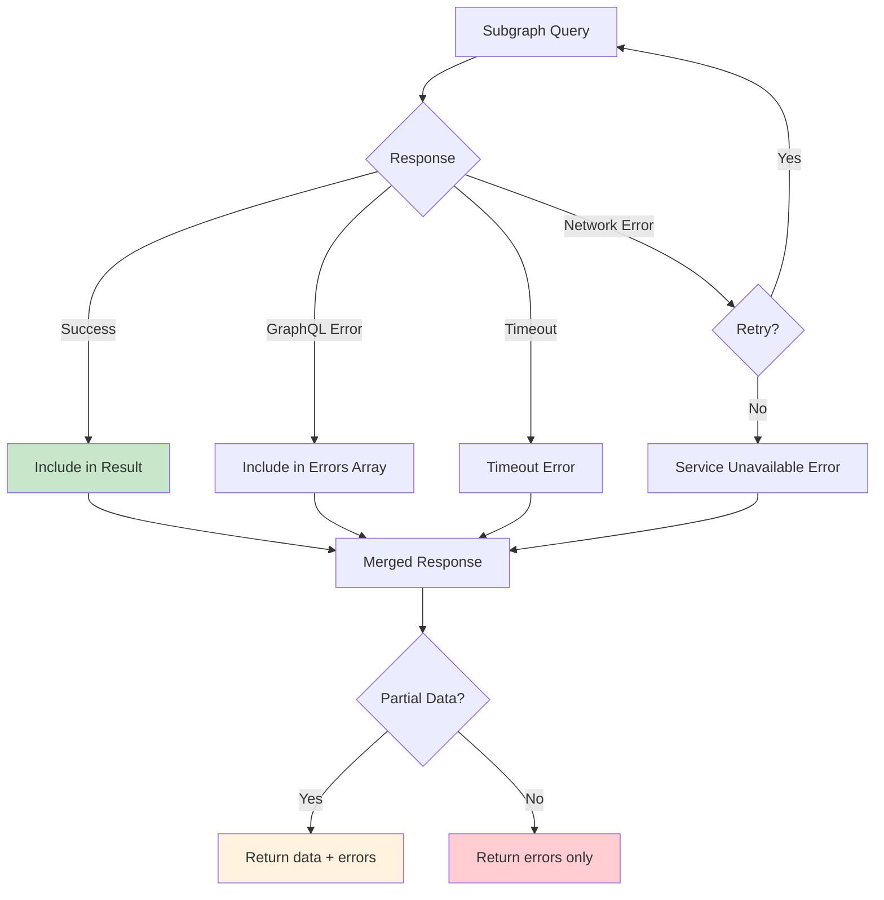

**Error Response Format:**

```json
{
  "data": {
    "transactions": [
      {
        "id": "trans-001",
        "amount": 50000,
        "status": "completed"
      }
    ],
    "analyticsStats": null
  },
  "errors": [
    {
      "message": "Service temporarily unavailable",
      "path": ["analyticsStats"],
      "extensions": {
        "code": "SERVICE_UNAVAILABLE",
        "serviceName": "analytics"
      }
    }
  ]
}
```

## CORS Configuration

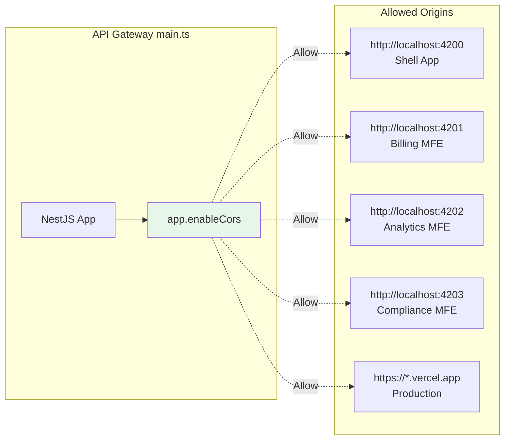

**CORS Configuration Code:**

```typescript
// apps/api-gateway/src/main.ts
async function bootstrap() {
  const app = await NestFactory.create(AppModule);

  // Enable CORS for all frontend applications
  app.enableCors({
    origin: [
      'http://localhost:4200',
      'http://localhost:4201',
      'http://localhost:4202',
      'http://localhost:4203',
      /\.vercel\.app$/, // All Vercel deployments
    ],
    credentials: true,
  });

  await app.listen(process.env.PORT || 3000);
}
```

## Caching Strategy

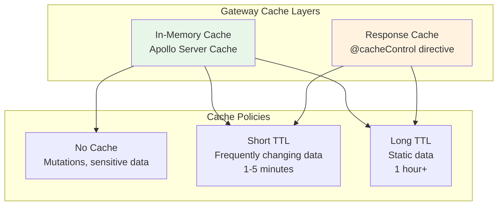

**Cache Control Example:**

```graphql
type Query {
  # Cached for 5 minutes
  transactions: [Transaction] @cacheControl(maxAge: 300)

  # Cached for 1 hour
  revenueStats: RevenueStats @cacheControl(maxAge: 3600)

  # Never cached
  currentUser: User @cacheControl(maxAge: 0)
}
```

## Performance Optimizations

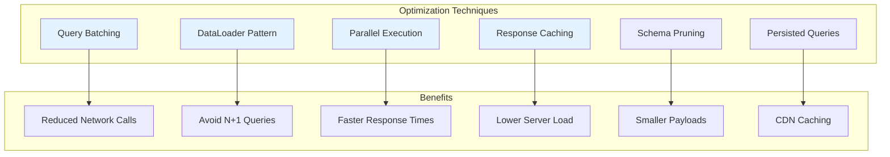

## Monitoring & Observability

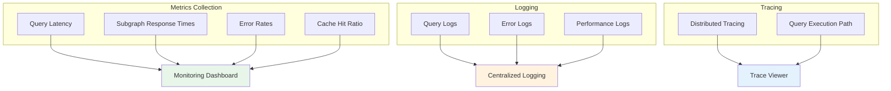

## GraphQL Playground & Introspection

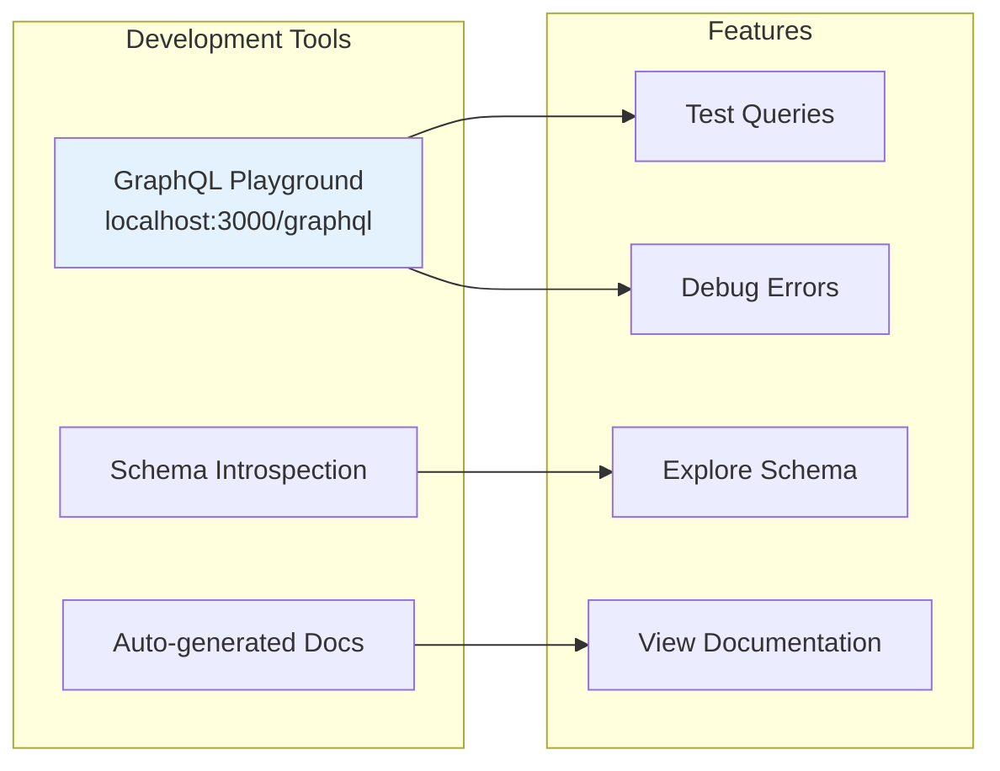

## Gateway Startup Flow

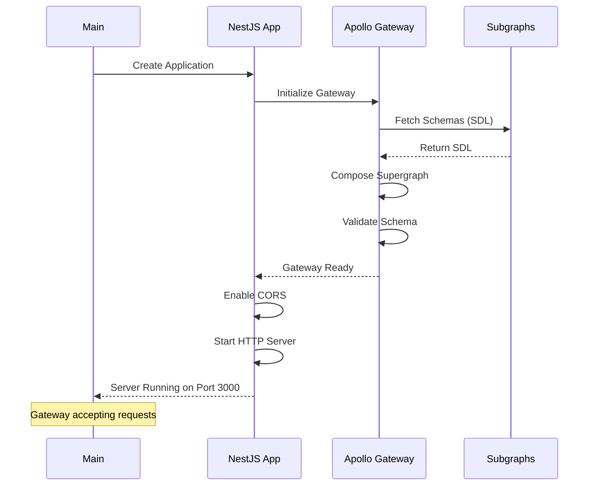

## Unified GraphQL Schema

```graphql
# Composed Supergraph Schema (Auto-generated)
type Query {
  # From Auth Service
  user(id: ID!): User

  # From Billing Service
  transactions(limit: Int): [Transaction!]!
  revenueStats: RevenueStats!

  # From Analytics Service
  analyticsStats: AnalyticsStats!
  recentActivity(limit: Int): [ActivityLog!]!

  # From Compliance Service
  complianceStats: ComplianceStats!
  complianceChecks: [ComplianceCheck!]!
  auditLogs(limit: Int): [AuditLog!]!
}

type Mutation {
  # From Auth Service
  googleLogin(credential: String!): AuthResponse!
}

# Types from various services
type User {
  id: ID!
  email: String!
  name: String!
  roles: [String!]!
  permissions: [String!]!
}

type Transaction {
  id: ID!
  customerName: String!
  amount: Float!
  status: String!
  date: String!
}

type RevenueStats {
  totalRevenue: Float!
  monthlyGrowth: Float!
  pendingInvoices: Int!
  nextPayoutDate: String!
}

# ... more types from other services
```

## Key Design Decisions

1. **Apollo Federation**: Industry-standard for GraphQL composition
2. **Managed Federation**: Services register their schemas autonomously
3. **No Schema Stitching**: Federation provides better performance and type safety
4. **Service List**: Static configuration via environment variables
5. **CORS Enabled**: Allow cross-origin requests from all frontends
6. **No Authentication Middleware**: Authentication handled by individual services
7. **Stateless Gateway**: No business logic, only query routing

## Deployment Considerations

- **Scaling**: Gateway can be horizontally scaled
- **Health Checks**: Monitor gateway and subgraph health
- **Circuit Breakers**: Prevent cascading failures
- **Rate Limiting**: Protect against abuse
- **Load Balancing**: Distribute traffic across gateway instances

## Future Enhancements

- [ ] Add Apollo Studio for schema management
- [ ] Implement persisted queries
- [ ] Add distributed tracing (OpenTelemetry)
- [ ] Implement query complexity analysis
- [ ] Add rate limiting per user/client
- [ ] Implement response compression
- [ ] Add query allow-listing for production
- [ ] Implement schema versioning
