# Deployment Strategy & CI/CD

## Overview

The Orion Enterprise platform uses a modern deployment strategy with frontend applications on Vercel and backend services on Render, leveraging CI/CD for automated deployments.

## Deployment Architecture
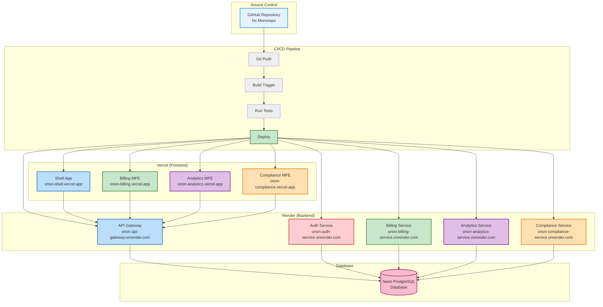
## CI/CD Pipeline Flow

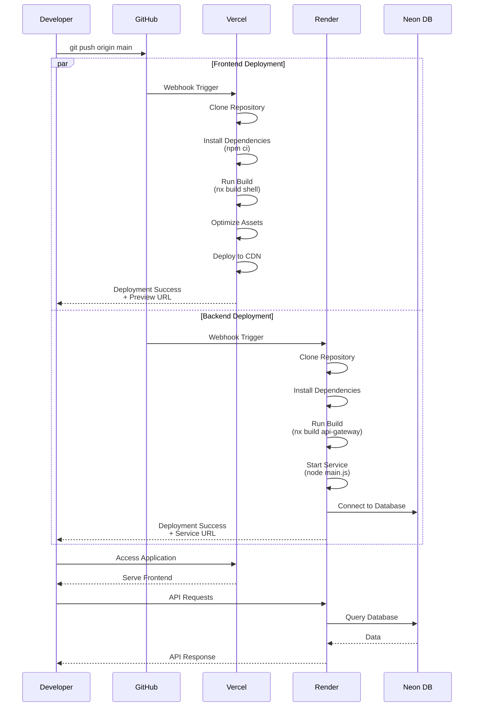

## Vercel Deployment Configuration

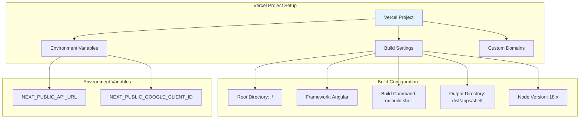

**Vercel Configuration File (`vercel.json`):**

```json
{
  "version": 2,
  "builds": [
    {
      "src": "dist/apps/shell/**/*",
      "use": "@vercel/static"
    }
  ],
  "routes": [
    {
      "src": "/(.*)",
      "dest": "/dist/apps/shell/$1"
    }
  ],
  "env": {
    "NEXT_PUBLIC_API_URL": "@api-url",
    "NEXT_PUBLIC_GOOGLE_CLIENT_ID": "@google-client-id"
  }
}
```

**Build Commands for Each App:**

```bash
# Shell Application
nx build shell --configuration=production

# Billing MFE
nx build billing --configuration=production

# Analytics MFE
nx build analytics --configuration=production

# Compliance MFE
nx build compliance --configuration=production
```

## Render Deployment Configuration

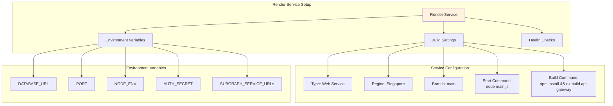

**Render Configuration File (`render.yaml`):**

```yaml
services:
  # API Gateway
  - type: web
    name: orion-api-gateway
    env: node
    region: singapore
    plan: free
    buildCommand: npm install && npx nx build api-gateway --verbose
    startCommand: node dist/apps/api-gateway/main.js
    envVars:
      - key: NODE_ENV
        value: production
      - key: PORT
        value: 3000
      - key: DATABASE_URL
        sync: false
      - key: AUTH_SERVICE_URL
        value: https://orion-auth-service.onrender.com/graphql
      - key: BILLING_SERVICE_URL
        value: https://orion-billing-service.onrender.com/graphql
      - key: ANALYTICS_SERVICE_URL
        value: https://orion-analytics-service.onrender.com/graphql
      - key: COMPLIANCE_SERVICE_URL
        value: https://orion-compliance-service.onrender.com/graphql

  # Auth Service
  - type: web
    name: orion-auth-service
    env: node
    region: singapore
    plan: free
    buildCommand: npm install && npx nx build auth-service
    startCommand: node dist/apps/auth-service/main.js
    envVars:
      - key: NODE_ENV
        value: production
      - key: PORT
        value: 3001
      - key: AUTH_SECRET
        sync: false
      - key: GOOGLE_CLIENT_ID
        sync: false

  # Billing Service
  - type: web
    name: orion-billing-service
    env: node
    region: singapore
    plan: free
    buildCommand: npm install && npx nx build billing-service && npx prisma generate --schema=apps/billing-service/prisma/schema.prisma
    startCommand: node dist/apps/billing-service/main.js
    envVars:
      - key: NODE_ENV
        value: production
      - key: PORT
        value: 3006
      - key: DATABASE_URL
        sync: false

  # ... Additional services follow same pattern
```

## Environment Variables Management

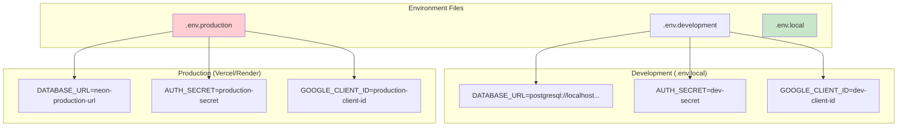

**Critical Environment Variables:**

| Variable           | Service                   | Purpose                              |
| ------------------ | ------------------------- | ------------------------------------ |
| `DATABASE_URL`     | All Backend Services      | Neon PostgreSQL connection string    |
| `AUTH_SECRET`      | Auth Service, API Gateway | JWT signing secret                   |
| `GOOGLE_CLIENT_ID` | Shell App, Auth Service   | Google OAuth client ID               |
| `PORT`             | All Backend Services      | Service port number                  |
| `NODE_ENV`         | All Services              | Environment (development/production) |
| `*_SERVICE_URL`    | API Gateway               | Subgraph service URLs                |

## Database Migration Strategy

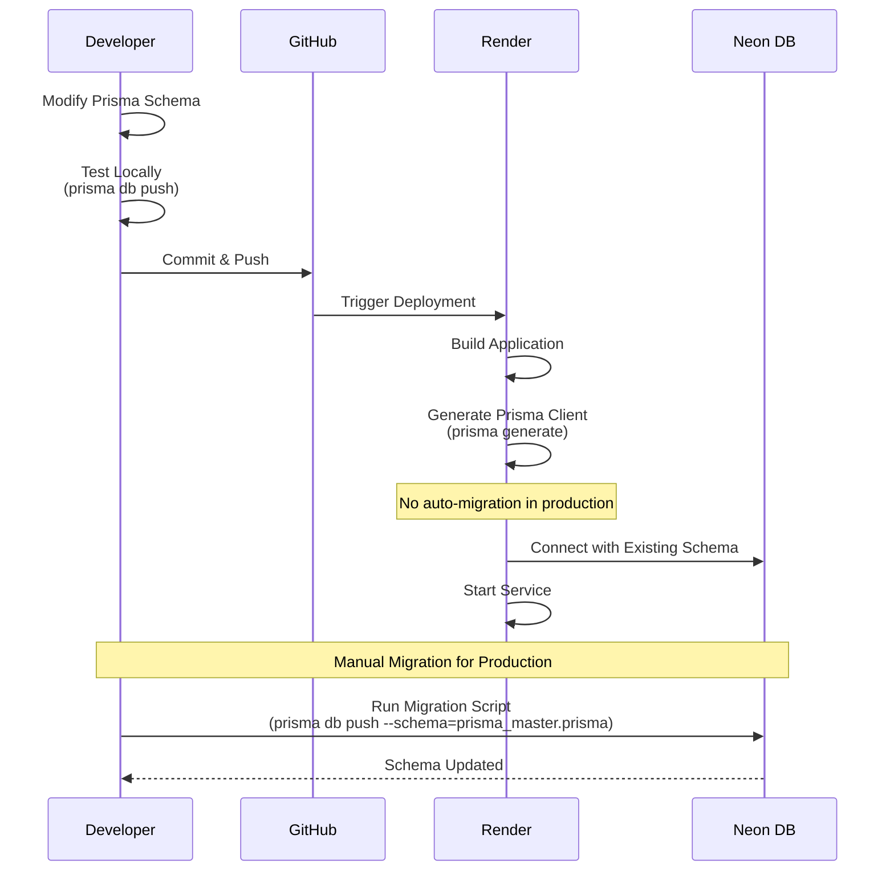

**Migration Commands:**

```bash
# Development - Auto-apply schema changes
DATABASE_URL="postgresql://localhost..." npx prisma db push --schema=prisma_master.prisma

# Production - Manual migration
DATABASE_URL="postgresql://neon-production-url" npx prisma db push --schema=prisma_master.prisma

# Generate Prisma Client
npx prisma generate --schema=apps/billing-service/prisma/schema.prisma
```

## Build Optimization

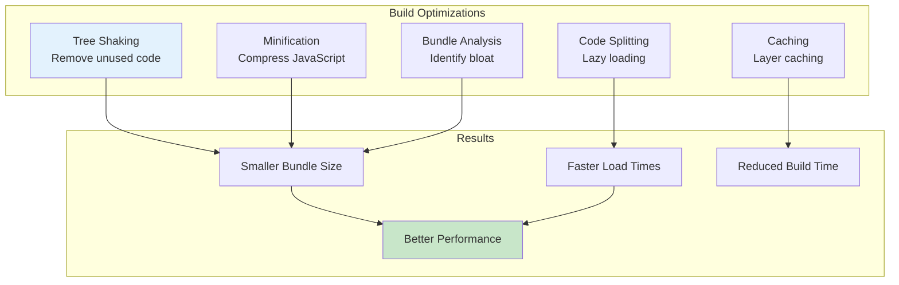

**Webpack Production Configuration:**

```javascript
// Automatically applied by Nx
module.exports = {
  mode: 'production',
  optimization: {
    minimize: true,
    splitChunks: {
      chunks: 'all',
      cacheGroups: {
        vendor: {
          test: /[\\/]node_modules[\\/]/,
          name: 'vendors',
          priority: 10,
        },
      },
    },
  },
};
```

## Deployment Workflow

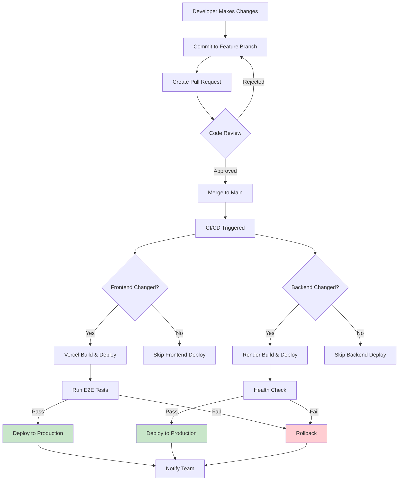

## Health Checks & Monitoring

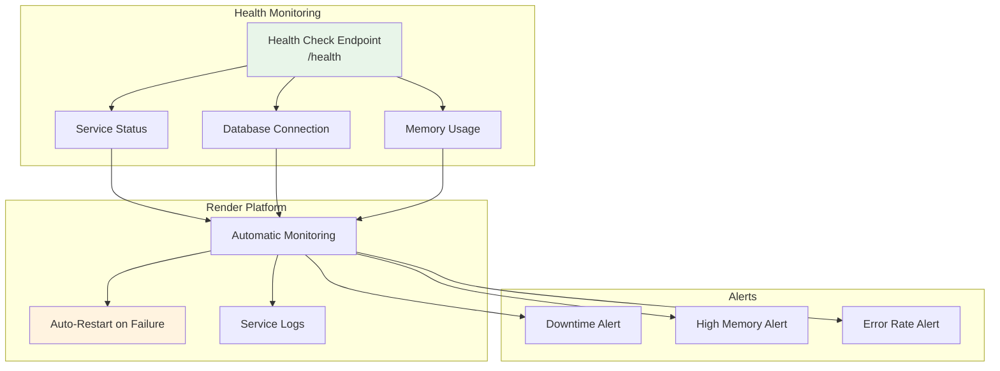

**Health Check Implementation:**

```typescript
// API Gateway Health Endpoint
@Controller('health')
export class HealthController {
  @Get()
  check() {
    return {
      status: 'ok',
      timestamp: new Date().toISOString(),
      service: 'api-gateway',
      uptime: process.uptime(),
    };
  }

  @Get('ready')
  async ready() {
    // Check database connection
    const isDbReady = await this.checkDatabase();

    return {
      status: isDbReady ? 'ready' : 'not_ready',
      database: isDbReady,
    };
  }
}
```

## Rollback Strategy

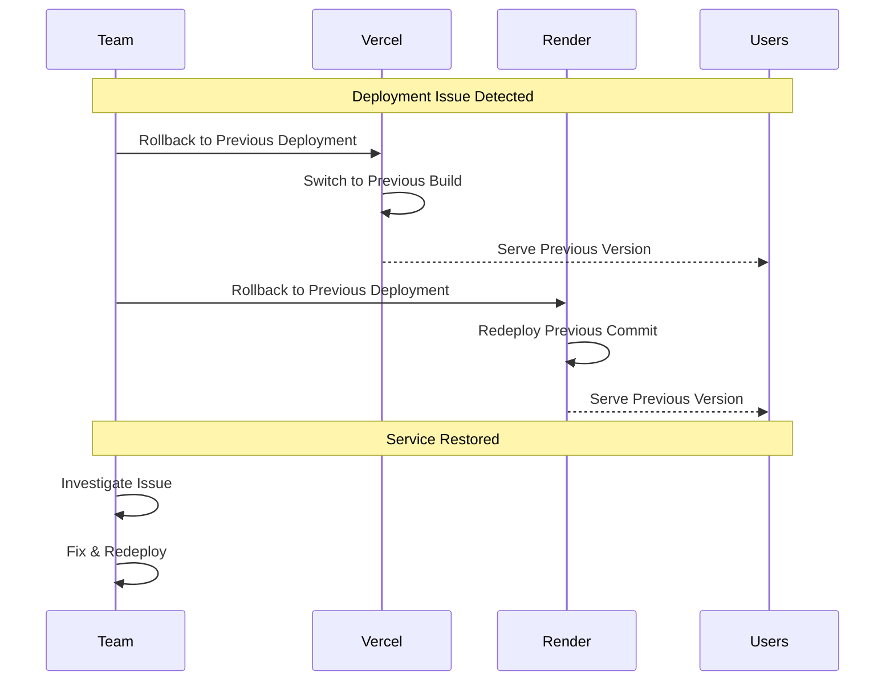

**Rollback Commands:**

```bash
# Vercel - Use Dashboard or CLI
vercel rollback <deployment-url>

# Render - Redeploy previous commit
render deploy --commit <previous-commit-hash>

# Or use Render Dashboard to trigger previous deployment
```

## Performance Metrics

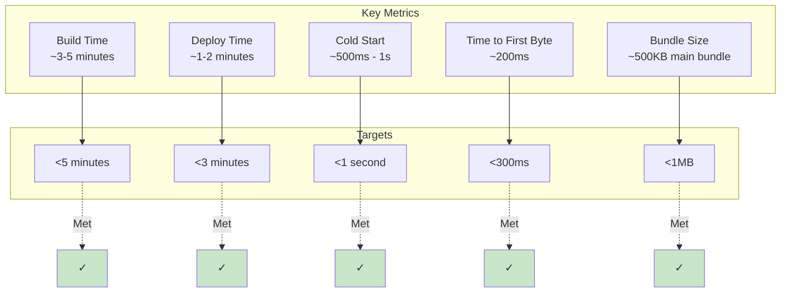

## Scaling Strategy

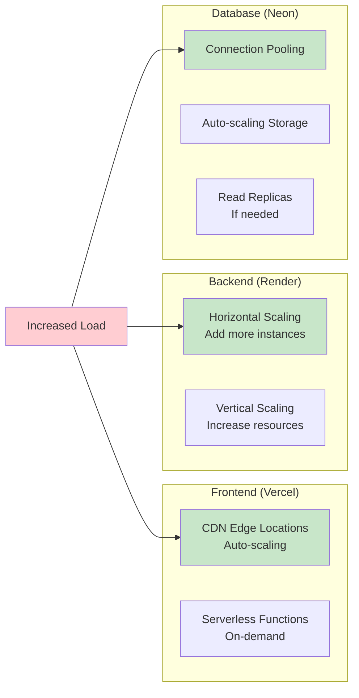

## Deployment Checklist

- [ ] **Pre-Deployment**
  - [ ] All tests passing
  - [ ] Code reviewed and approved
  - [ ] Environment variables updated
  - [ ] Database migrations tested
  - [ ] Bundle size analyzed

- [ ] **Deployment**
  - [ ] Frontend deployed to Vercel
  - [ ] Backend services deployed to Render
  - [ ] Health checks passing
  - [ ] CORS configuration verified
  - [ ] API endpoints accessible

- [ ] **Post-Deployment**
  - [ ] Smoke tests executed
  - [ ] User acceptance testing
  - [ ] Performance monitoring
  - [ ] Error tracking enabled
  - [ ] Team notified

## Key Design Decisions

1. **Vercel for Frontend**: Best Angular/Next.js deployment experience, CDN, automatic previews
2. **Render for Backend**: Simple NestJS deployment, free tier, managed services
3. **Neon for Database**: Serverless PostgreSQL, auto-scaling, branching
4. **Monorepo with Nx**: Unified codebase, shared libraries, affected commands
5. **Automated Deployments**: Git push triggers CI/CD
6. **No Docker**: Use platform-native builds for simplicity
7. **Environment-based Configuration**: Different configs for dev/staging/prod

## Future Enhancements

- [ ] Add staging environment
- [ ] Implement blue-green deployments
- [ ] Add automated E2E tests in CI
- [ ] Implement feature flags for gradual rollouts
- [ ] Add performance budgets in CI
- [ ] Implement automated database backups
- [ ] Add canary deployments
- [ ] Integrate monitoring tools (Datadog, Sentry)
